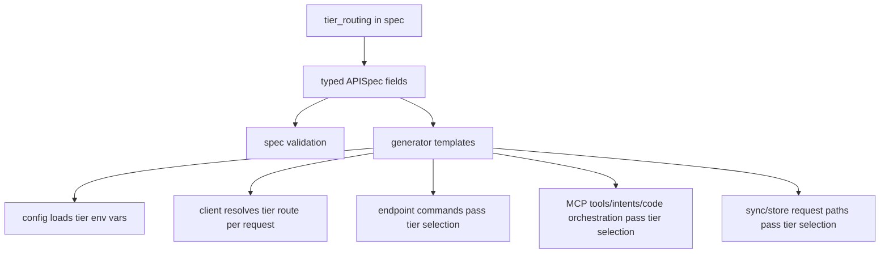
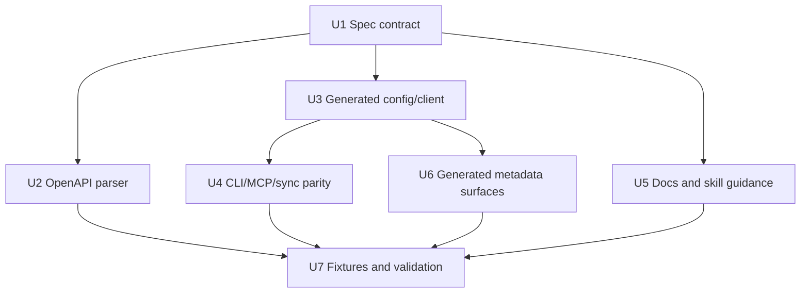
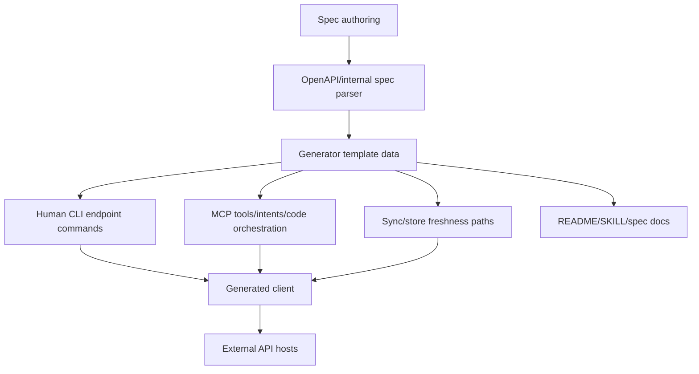

# feat(cli): spec-driven tier routing for generated CLIs

## Overview

Add an opt-in `tier_routing` contract to Printing Press specs so generated CLIs can route different endpoint groups through different credential/base-URL tiers without hand-written helper packages. This closes issue #539: Phase 1 can already notice when a free primary source would be accidentally gated by a paid secondary source, but the decision cannot currently survive into generated code.

The core design is typed and explicit:

- `APISpec.TierRouting` declares named tiers.
- Each tier can provide a base URL and a limited auth block.
- Resources and endpoints can select a tier; endpoint selection wins over resource selection.
- Generated request paths, auth headers, MCP tools, and sync code use the selected tier only when the spec opts in.

---

## Problem Frame

The generator currently assumes one global auth/base URL contract per printed CLI. `APISpec.BaseURL` and `APISpec.Auth` drive generated config, client, doctor, README, MCP metadata, and endpoint command behavior. `Resource.BaseURL` already handles host routing for resources on another host, but it does not solve credential routing: every request still uses the same generated `Config.AuthHeader()` value.

This is wrong for combo or tiered APIs where:

- headline/free commands should work without a paid credential;
- paid enrichment commands should use a separate env var and sometimes a separate host;
- the skill's source-priority/economics decision should become machine-readable generation input.

Without a spec-level contract, agents either over-gate the whole CLI behind the paid key or hand-write per-CLI helper logic that does not compound.

---

## Requirements Trace

- R1. Specs support a `tier_routing` block that can express named free/paid credential routing without per-CLI helper packages.
- R2. Resources and endpoints can opt into a named tier, with endpoint-level selection overriding inherited resource-level selection.
- R3. The generator emits tier routing only when the spec opts in; specs without `tier_routing` keep the existing single-auth/single-base behavior.
- R4. Generated free-tier commands do not require or report missing paid-tier env vars before making free-tier requests, and env-sourced tier credentials are not serialized into config files.
- R5. Generated paid-tier commands use the paid tier's configured env vars, auth format/header/query placement, and base URL when selected.
- R6. MCP endpoint tools, intent/code orchestration paths, and sync/store reads preserve the same tier selection as the human CLI.
- R7. Phase 2 spec enrichment docs explain detection/action/skip rules for adding `tier_routing`.
- R8. OpenAPI parser support exists for authoring tier routing through documented `x-*` extensions when the source is OpenAPI.
- R9. Generated README, doctor, manifest, and install metadata describe tier credentials without making paid-tier credentials globally required.

---

## Scope Boundaries

- In scope: REST endpoint mirrors, internal YAML specs, OpenAPI extensions, generated CLI requests, generated MCP endpoint surfaces, generated sync/store reads, generated docs/spec references, and tests/fixtures.
- In scope: tier auth modes that map cleanly to the current generated config/client model: `none`, `api_key`, and `bearer_token`.
- Out of scope: OAuth2, session-handshake, cookie, and composed-auth tiers. These require stateful login/session machinery and should not be squeezed into the first tier-routing contract.
- Out of scope: automatic inference of paid/free tiers from arbitrary vendor prose. Phase 2 docs may instruct agents when to add the block, but the generator should consume explicit spec data.
- Out of scope: changing existing `auth.optional` semantics. Optional global auth remains separate from endpoint tier routing.
- Out of scope: using tier routing with `client_pattern: proxy-envelope` in the initial implementation. Proxy-envelope posts all requests to one proxy endpoint, so per-tier base URL/auth selection needs a separate design.
- Out of scope: retrofitting existing catalog entries, local library CLIs, or public library CLIs. This plan changes the machine for future generated CLIs; reprinting or migration is separate work.

### Deferred to Follow-Up Work

- OAuth/session-aware tier routing: separate issue once a real CLI needs multiple stateful auth mechanisms.
- Scorecard/audit dimensions for detecting missed tier routing: follow-up after the generation contract exists and has examples.

---

## Context & Research

### Relevant Code and Patterns

- `internal/spec/spec.go` defines `APISpec.Auth`, `APISpec.BaseURL`, `Resource.BaseURL`, `Endpoint.Meta`, `Endpoint.HeaderOverrides`, and validation. This is the right layer for a typed tier-routing contract.
- `internal/generator/templates/config.go.tmpl` loads auth env vars into generated config and emits `Config.AuthHeader()`.
- `internal/generator/templates/client.go.tmpl` builds target URLs and applies auth on every request.
- `internal/generator/templates/command_endpoint.go.tmpl` is the primary human CLI endpoint mirror path.
- `internal/generator/templates/mcp_tools.go.tmpl`, `internal/generator/templates/mcp_intents.go.tmpl`, and `internal/generator/templates/mcp_code_orch.go.tmpl` are agent-facing request paths that must stay in parity with the CLI.
- `internal/generator/templates/sync.go.tmpl` and `internal/generator/templates/data_source.go.tmpl` can call endpoint request paths outside the direct command handler, so tier metadata must be available there too.
- `internal/openapi/parser.go` already maps Printing Press-specific `x-*` extensions into `APISpec`; `docs/SPEC-EXTENSIONS.md` is the canonical doc that must change with new extension lookups.
- `skills/printing-press/references/spec-format.md` documents internal YAML fields, including current `base_url`, `auth`, resource `base_url`, and validation rules.
- `skills/printing-press/SKILL.md` already has the source-priority economics check and records `auth_scoping` in `source-priority.json`, but it does not tell agents how to encode the decision into the spec.

### Institutional Learnings

- `docs/brainstorms/2026-03-31-auth-error-handling-requirements.md` established that auth checks must be per-call, not startup-wide, so unauthenticated endpoints keep working without credentials.
- `docs/plans/2026-04-05-002-feat-per-endpoint-headers-and-auth-param-inference-plan.md` is the closest pattern for per-endpoint request customization. It added typed endpoint metadata plus generated request plumbing rather than hand-written per-CLI fixes.
- `docs/solutions/best-practices/multi-source-api-discovery-design-2026-03-30.md` reinforces using explicit, testable base-URL configuration for multi-source external integrations.

### External References

- None. The work is an internal generator/spec contract. External API behavior motivates the feature, but local templates and specs determine the implementation.

---

## Key Technical Decisions

- **Typed spec fields, not `Endpoint.Meta`:** Tier routing should be first-class because it controls auth and target hosts. `Meta` is useful for discovery confidence, but credential routing needs validation, docs, and template awareness.
- **Named tiers with a small auth subset:** Use named tiers such as `free` and `paid`, each carrying `base_url` plus an auth block shaped like the existing auth fields. Limit first implementation to `none`, `api_key`, and `bearer_token` so generated code can stay stateless and per-request.
- **Endpoint tier overrides resource tier:** Resource-level tiering covers common "all paid endpoints live under this resource" cases. Endpoint-level tiering covers mixed resources. Endpoint wins because it is the most specific declaration.
- **No implicit global auth requirement from paid tiers:** A paid tier's env vars should be loaded and used only when a paid-tier request path is selected. Doctor/README may mention available tier credentials, but free-tier command execution must not preflight or fail on missing paid env vars.
- **Selected tier auth is authoritative:** When an endpoint has an effective tier, that tier's auth controls the request. A selected `auth.type: none` suppresses global auth for that request; a selected paid tier does not fall back to global auth if its own credential is missing. Endpoints with no selector and no `default_tier` keep the existing global auth/base-URL behavior.
- **Reuse existing request plumbing shape:** The generated client should keep current no-tier call behavior for non-tiered specs. When tier routing is enabled, request helpers should accept enough tier context to choose base URL and auth without duplicating request construction in command templates.
- **MCP parity is part of the core feature:** Endpoint mirrors in `tools.go`, intents, and code orchestration must use the same tier route as CLI commands. Agent-facing parity is not a polish task.
- **Validate ambiguous base URL combinations:** If an endpoint has an effective resource `base_url` and also selects a tier with `base_url`, validation should reject or require an explicit resolution. The plan recommends rejecting first; a future design can add precedence if a real API needs it.
- **Credential routing has a trust boundary:** Auth-bearing tier base URLs must be absolute HTTPS URLs, must not target loopback/private/link-local hosts, and must either stay within the global API host family or carry explicit reviewed metadata allowing cross-host credential routing.
- **Tier doctor checks are presence-only in v1:** Doctor can report configured/missing tier credentials, but it should not network-probe tier credentials until the spec model has tier-specific verify paths and host guarantees.

---

## Open Questions

### Resolved During Planning

- **Q: Should this be a new auth mode or a separate routing block?** Separate routing block. Global `auth` still describes the default CLI credential; tier routing describes endpoint-specific overrides.
- **Q: Should resource `base_url` be reused for tiers?** No. Resource `base_url` is host routing; tier routing is credential/host selection. They interact but are not the same concept.
- **Q: Should missing paid credentials fail at startup?** No. Existing auth-error requirements and mixed-auth behavior require per-call failures only.
- **Q: Should OpenAPI support wait until after internal YAML support?** No. Issue #539 explicitly calls for parser support, and `docs/SPEC-EXTENSIONS.md` provides an existing extension path.
- **Q: What happens when `tier_routing` exists but an endpoint has no selector and no default tier?** It keeps existing global auth/base behavior. Tier routing changes only endpoints with an effective selected tier.
- **Q: Can `no_auth` and tier auth disagree?** No. `no_auth: true` and OpenAPI `security: []` are public-endpoint claims; they must not be combined with an effective auth-bearing tier. An effective `auth.type: none` should count as public for MCP descriptions without mutating `Endpoint.NoAuth`.

### Deferred to Implementation

- Exact generated helper names and method names are implementation details.
- Whether tier auth formatting reuses `applyAuthFormat` directly or a small generated tier-auth wrapper depends on template ergonomics.
- Whether no-tier generated output remains byte-identical for every file or only behaviorally equivalent depends on the cleanest template gating. The plan expects no visible behavior change for non-tiered specs.

---

## High-Level Technical Design

> *This illustrates the intended approach and is directional guidance for review, not implementation specification. The implementing agent should treat it as context, not code to reproduce.*

### Contract Sketch

```yaml
tier_routing:
  default_tier: free
  tiers:
    free:
      base_url: https://free-api.example.com
      auth:
        type: none
    paid:
      base_url: https://paid-api.example.com
      auth:
        type: api_key
        header: Authorization
        format: "Bearer {token}"
        env_vars:
          - PAID_API_KEY

resources:
  search:
    tier: free
    endpoints:
      list:
        method: GET
        path: /search
      enriched:
        tier: paid
        method: GET
        path: /enriched-search
```

### Request Flow



---

## Implementation Units



- U1. **Add the tier-routing spec contract**

**Goal:** Represent tier routing as typed, validated spec data.

**Requirements:** R1, R2, R3, R5

**Dependencies:** None

**Files:**
- Modify: `internal/spec/spec.go`
- Test: `internal/spec/spec_test.go`
- Test: `testdata/operations-shorthand.yaml` or a new compact internal YAML fixture if round-trip coverage needs a fixture

**Approach:**
- Add a root `TierRouting` block on `APISpec`.
- Add named tier definitions with optional `base_url` and limited auth configuration.
- Add resource and endpoint tier selectors.
- Add helper behavior for resolving the effective tier for an endpoint from endpoint selector, inherited resource selector, and default tier.
- Validate:
  - every selector references a declared tier;
  - `default_tier`, when set, references a declared tier, and when unset unselected endpoints fall back to global behavior;
  - tier auth type is one of the supported initial stateless modes;
  - tier env vars are present for auth modes that need them;
  - tier `auth.in` is `header`, `query`, or empty only where the auth type has a clear default;
  - tier auth header/query names are present when placement requires them;
  - tier auth formats reference declared placeholders only;
  - `no_auth: true` is not combined with an effective auth-bearing tier;
  - `client_pattern: proxy-envelope` is rejected when tier routing is configured;
  - auth-bearing tier base URLs satisfy the trust-boundary policy;
  - tier `base_url` is not combined ambiguously with an effective resource `base_url`.

**Execution note:** Start with failing spec round-trip and validation tests before changing templates.

**Patterns to follow:**
- `Resource.BaseURL` validation and `HasResourceBaseURLOverride()` in `internal/spec/spec.go`.
- `Endpoint.HeaderOverrides` as typed per-endpoint request metadata.
- `AuthConfig` validation patterns for supported auth modes and env vars.

**Test scenarios:**
- Happy path: YAML with `tier_routing`, two tiers, resource selector, and endpoint override unmarshals into the expected typed fields.
- Happy path: endpoint selector overrides inherited resource selector.
- Happy path: spec without `tier_routing` validates unchanged.
- Error path: endpoint references an unknown tier and validation names the invalid selector.
- Error path: tier with `api_key` or `bearer_token` but no env var fails validation.
- Error path: unsupported tier auth type such as `oauth2` fails validation with an explicit unsupported-mode message.
- Error path: malformed `auth.in`, missing header/query names, and undeclared auth-format placeholders fail validation.
- Error path: `no_auth: true` plus auth-bearing selected tier fails validation.
- Error path: auth-bearing tier base URL using `http://`, loopback, private-network, or unreviewed cross-host routing fails validation.
- Error path: `client_pattern: proxy-envelope` plus `tier_routing` fails validation.
- Error path: effective resource `base_url` plus selected tier `base_url` fails validation until a future design defines precedence.

**Verification:**
- Spec data can express #539's free/paid routing case without changing existing global auth semantics.

---

- U2. **Parse tier routing from OpenAPI extensions**

**Goal:** Allow OpenAPI specs to declare the same tier-routing contract through documented Printing Press `x-*` extensions.

**Requirements:** R1, R2, R8

**Dependencies:** U1

**Files:**
- Modify: `internal/openapi/parser.go`
- Modify: `docs/SPEC-EXTENSIONS.md`
- Test: `internal/openapi/parser_test.go`
- Create: `testdata/openapi/tier-routing.yaml`

**Approach:**
- Add `info.x-tier-routing` support that maps to the root `APISpec.TierRouting` block.
- Add path-item and operation-level tier selector support. Operation-level selection should override path-item selection, mirroring endpoint specificity.
- Define OpenAPI precedence explicitly: `x-tier` controls generated tier routing, but it must not contradict an operation that declares `security: []`; such conflicts should fail validation rather than silently choosing one source.
- Keep extension parsing strict enough to avoid silent nonsense: non-map root blocks, non-string tier names, and unknown tier references should surface through spec validation.
- Document every extension location and field in `docs/SPEC-EXTENSIONS.md` in the same change as parser code.

**Patterns to follow:**
- Existing `info.x-proxy-routes` parsing in `internal/openapi/parser.go`.
- Existing security scheme `x-auth-*` parsing and documentation in `docs/SPEC-EXTENSIONS.md`.
- Path-item metadata mapping for `x-resource-id` and `x-critical`.

**Test scenarios:**
- Happy path: `info.x-tier-routing` with `free` and `paid` tiers maps to `APISpec.TierRouting`.
- Happy path: path-item `x-tier: paid` applies to all operations under that path.
- Happy path: operation-level `x-tier: free` overrides path-item `paid`.
- Error path: malformed `x-tier-routing` produces either an empty block that validation rejects or a direct parse error, depending on existing parser convention.
- Error path: operation with `security: []` and `x-tier` selecting an auth-bearing tier fails validation.
- Integration: generated `testdata/openapi/tier-routing.yaml` parses and validates.

**Verification:**
- OpenAPI authors can express the same route/credential split as internal YAML authors.

---

- U3. **Emit tier-aware generated config and client plumbing**

**Goal:** Make generated runtime code able to resolve base URL and auth for the selected tier per request.

**Requirements:** R3, R4, R5

**Dependencies:** U1

**Files:**
- Modify: `internal/generator/templates/config.go.tmpl`
- Modify: `internal/generator/templates/client.go.tmpl`
- Modify: `internal/generator/generator.go`
- Test: `internal/generator/generator_test.go`
- Test: `internal/generator/auth_env_precedence_test.go` if tier auth overlaps existing precedence tests

**Approach:**
- Gate all new generated code behind `tier_routing` presence.
- Resolve tier env vars without making them global auth env vars and without serializing env-sourced tier credentials into saved config.
- Generate tier auth resolution that mirrors the existing `AuthHeader()` behavior for the supported stateless modes.
- Make selected tier auth authoritative: `auth.type: none` sends no global auth, and missing selected-tier credentials do not fall back to global credentials.
- Generate target URL resolution that chooses the selected tier's base URL when present, otherwise falls back to current base URL behavior.
- Preserve existing endpoint-template-var substitution behavior for tier base URLs by collecting placeholders from tier base URLs into the generated template-var set and validating unresolved placeholders.
- Keep non-tiered specs behaviorally unchanged.

**Execution note:** Add generator characterization tests for a spec without `tier_routing` before changing common templates.

**Patterns to follow:**
- Env-var loading and built-in field de-duplication in `config.go.tmpl`.
- `AuthHeader()` formatting and `applyAuthFormat` behavior in `config.go.tmpl`.
- `buildURL`, `EndpointTemplateVars`, and resource `base_url` branches in `client.go.tmpl`.
- Existing auth precedence tests in `internal/generator/auth_env_precedence_test.go`.

**Test scenarios:**
- Happy path: generated config includes paid tier env var storage when `tier_routing` declares a paid tier.
- Happy path: free-tier request code path does not require the paid env var to be set.
- Happy path: selected free tier with `auth.type: none` suppresses global auth for that request.
- Happy path: paid-tier request code path formats its configured header using the paid env var.
- Happy path: query-placed tier auth sends credentials as the configured query parameter.
- Happy path: tier base URL routes paid and free requests to different hosts.
- Edge case: tier base URL with trailing slash combines cleanly with endpoint paths.
- Edge case: tier base URL with endpoint template variables emits actionable missing-env errors consistent with existing placeholder behavior.
- Error path: env-provided paid-tier credential is not written to the generated config file by save/update paths.
- Regression: generated output for a no-tier spec does not introduce tier env var or tier auth helper code.

**Verification:**
- A generated CLI can issue free and paid requests through one client without making paid auth global.

---

- U4. **Apply tier selection across CLI, MCP, and sync request paths**

**Goal:** Ensure every generated surface that can call an endpoint uses the same effective tier.

**Requirements:** R4, R5, R6

**Dependencies:** U1, U3

**Files:**
- Modify: `internal/generator/generator.go`
- Modify: `internal/generator/templates/command_endpoint.go.tmpl`
- Modify: `internal/generator/templates/command_promoted.go.tmpl`
- Modify: `internal/generator/templates/mcp_tools.go.tmpl`
- Modify: `internal/generator/templates/mcp_intents.go.tmpl`
- Modify: `internal/generator/templates/mcp_code_orch.go.tmpl`
- Modify: `internal/profiler/profiler.go`
- Modify: `internal/generator/templates/sync.go.tmpl`
- Modify: `internal/generator/templates/auto_refresh.go.tmpl`
- Modify: `internal/generator/templates/data_source.go.tmpl` if freshness/store read helpers need tier context
- Test: `internal/generator/generator_test.go`
- Test: `internal/generator/skill_test.go` if generated SKILL examples include tiered commands

**Approach:**
- Compute effective tier metadata once in generator template data rather than duplicating selector logic in each template.
- Pass tier selection into endpoint handlers, promoted single-endpoint commands, raw MCP endpoint tools, MCP intents, code orchestration, and sync-generated request calls.
- For sync and auto-refresh, either add effective tier fields to profiler syncable/dependent metadata or generate a path-to-tier registry; do not rely on path strings alone if two endpoints could share a path with different tier semantics.
- Keep generated command annotations and MCP auth metadata coherent: endpoint tools for effective `auth.type: none` tiers should count as public for descriptions/readiness without overloading `Endpoint.NoAuth`.
- Ensure resource `base_url` behavior remains unchanged for non-tiered resources.

**Patterns to follow:**
- `ResourceBaseURL` template data in `internal/generator/generator.go`.
- Existing `HeaderOverrides` branching in `command_endpoint.go.tmpl`.
- Resource-base-URL parity tests in `TestGenerateResourceBaseURLOverrideRoutesToOverrideHost`.
- MCP handler path parity assertions in `internal/generator/generator_test.go`.

**Test scenarios:**
- Happy path: generated human CLI free command routes to free tier base URL and does not mention paid env var in the request path.
- Happy path: generated human CLI paid command routes to paid tier base URL and uses paid auth.
- Happy path: promoted single-endpoint resource receives the same tier behavior as non-promoted endpoint files.
- Happy path: typed MCP endpoint tool uses the same tier path/auth as the CLI command.
- Happy path: MCP intent/code-orchestration endpoint dispatch preserves tier selection.
- Happy path: sync path for a tiered GET endpoint uses the endpoint's effective tier.
- Happy path: auto-refresh/freshness path for a tiered resource uses the same effective tier as direct sync.
- Regression: MCP public counts/descriptions treat effective no-auth tiers as public without mutating `Endpoint.NoAuth`.
- Regression: resource `base_url` override tests continue passing for specs without tier routing.

**Verification:**
- There is no human/agent split where a free endpoint works in CLI but is gated or misrouted through MCP, or vice versa.

---

- U5. **Teach agents and docs when to author tier routing**

**Goal:** Make Phase 2 enrichment produce the new spec contract instead of prose-only decisions or hand-written helper packages.

**Requirements:** R1, R7, R8

**Dependencies:** U1

**Files:**
- Modify: `skills/printing-press/SKILL.md`
- Modify: `skills/printing-press/references/spec-format.md`
- Test: documentation coverage is manual review plus any existing docs tests if applicable

**Approach:**
- Extend the Phase 2 pre-generation enrichment guidance with a tier-routing subsection.
- Detection rules:
  - use when research/source-priority says a free primary source would otherwise be gated by paid secondary auth;
  - use when endpoints in the same generated CLI require different env vars or hosts by source/tier;
  - skip when one optional global credential merely enriches all commands uniformly.
- Action rules:
  - add `tier_routing` to the spec;
  - mark free resources/endpoints with the free tier;
  - mark paid/enrichment endpoints with the paid tier;
  - keep `no_auth: true` separate from tier routing; use it only for endpoints that are public independently of tier configuration.
- Skip rules:
  - do not invent tiers without research evidence;
  - do not use tier routing for OAuth/session state in this first implementation;
  - do not use tier routing to hide paid-only headline behavior.
- Update the internal YAML spec reference with a compact example and validation rules.

**Patterns to follow:**
- Source-priority economics check in `skills/printing-press/SKILL.md`.
- Auth enrichment guidance in Phase 2 of `skills/printing-press/SKILL.md`.
- Existing internal YAML examples in `skills/printing-press/references/spec-format.md`.

**Test scenarios:**
- Test expectation: none for prose-only docs, but review should confirm docs name detection/action/skip rules and include a valid compact YAML example.

**Verification:**
- A future generation agent can read the skill and know when to add `tier_routing`, when not to add it, and what minimal spec shape to write.

---

- U6. **Update generated metadata and install surfaces**

**Goal:** Make tier credentials visible to users and agents without turning every tier into globally required auth.

**Requirements:** R4, R5, R9

**Dependencies:** U1, U3

**Files:**
- Modify: `internal/generator/templates/readme.md.tmpl`
- Modify: `internal/generator/templates/doctor.go.tmpl`
- Modify: `internal/pipeline/toolsmanifest.go`
- Modify: `internal/pipeline/toolsmanifest_test.go`
- Modify: `internal/pipeline/climanifest.go`
- Modify: `internal/pipeline/mcpb_manifest.go`
- Modify: `internal/authdoctor/classify.go`
- Test: `internal/pipeline/climanifest_test.go`
- Test: `internal/pipeline/mcpb_manifest_test.go`
- Test: `internal/authdoctor/*_test.go`
- Modify: `internal/generator/templates/mcp_tools.go.tmpl` if runtime MCP metadata needs tier auth details beyond request dispatch
- Test: `internal/generator/readme_test.go`
- Test: `internal/generator/generator_test.go`
- Test: `internal/pipeline/toolsmanifest_test.go`

**Approach:**
- README should document tier credentials as scoped setup: free/core commands first, paid/enrichment credentials only for tiered paid commands.
- Doctor should report tier credential presence only in v1; it must not probe paid credentials against any host until tier-specific verify metadata exists.
- `tools-manifest.json` should expose enough tier auth metadata for downstream MCP/auth-doctor tooling to know which env vars exist and whether they are globally required or tier-scoped.
- `.printing-press.json` and MCPB/user-config generation must not mark paid-tier env vars as globally required for a CLI whose free tier works without them.
- Update auth-doctor classification to understand tier-scoped auth instead of classifying tiered CLIs as globally paid, globally no-auth, or unknown.
- Keep existing global auth metadata unchanged for specs without tier routing.

**Patterns to follow:**
- Optional auth README and doctor behavior in `internal/generator/auth_optional_test.go`.
- Current manifest auth serialization in `internal/pipeline/toolsmanifest.go`.
- CLI manifest and MCPB user-config generation in `internal/pipeline/climanifest.go` and `internal/pipeline/mcpb_manifest.go`.
- Auth doctor manifest classification in `internal/authdoctor/classify.go`.
- Existing MCP auth metadata in `internal/generator/templates/mcp_tools.go.tmpl`.

**Test scenarios:**
- Happy path: generated README names paid tier env vars under an optional/enrichment credential section, not as mandatory setup for all commands.
- Happy path: doctor reports free-tier readiness when paid-tier env vars are absent and paid-tier status as not configured.
- Happy path: `tools-manifest.json` includes tier-scoped env var metadata without changing the global required-auth classification for free-tier commands.
- Happy path: MCPB user config does not require paid-tier env vars for a CLI with working free-tier commands.
- Happy path: auth doctor reports tier-scoped credentials without treating missing paid credentials as a global failure.
- Error path: doctor does not send a paid credential to the global/free host.
- Regression: non-tiered API-key specs keep existing README, doctor, and manifest auth behavior.

**Verification:**
- Users and MCP hosts can discover paid tier credentials, but free-tier install/use remains possible without them.

---

- U7. **Add end-to-end fixtures and validation coverage**

**Goal:** Prove the issue-level acceptance criteria across parser, generator, docs, and behavior-sensitive fixtures.

**Requirements:** R1, R3, R4, R5, R6, R7, R8, R9

**Dependencies:** U2, U3, U4, U5, U6

**Files:**
- Modify: `internal/spec/spec_test.go`
- Modify: `internal/openapi/parser_test.go`
- Modify: `internal/generator/generator_test.go`
- Modify: `testdata/golden/fixtures/golden-api.yaml` only if the behavior should become a golden contract
- Modify: `testdata/golden/cases/` and `testdata/golden/expected/` only if adding a golden case is more useful than focused generator tests
- Create: `testdata/openapi/tier-routing.yaml`

**Approach:**
- Keep most coverage focused in package tests where assertions can inspect generated source and run a generated CLI against `httptest` servers.
- Add golden coverage only if the generated artifact contract should be locked at the CLI fixture level. If focused generator tests already prove the behavior without noisy fixture churn, run golden verification unchanged.
- Ensure at least one test exercises the exact #539 acceptance: a free-only credential path must not require paid-tier env vars.

**Patterns to follow:**
- Resource base URL generator tests around `TestGenerateResourceBaseURLOverrideRoutesToOverrideHost`.
- Auth env precedence tests around generated `AuthHeader()` behavior.
- OpenAPI extension parser tests for `x-auth-*` and `x-proxy-routes`.
- Golden harness guidance in `AGENTS.md`: update goldens only for intentional captured artifact drift.

**Test scenarios:**
- Integration: generate a tiered CLI with free and paid endpoints, run the free command with no paid env var, and observe the free test server receives the request.
- Integration: run the paid command with paid env var set, and observe the paid test server receives the expected auth header.
- Integration: run the paid command without paid env var and confirm the failure is per-call, not a startup failure blocking free commands.
- Integration: inspect generated MCP tools to confirm free and paid endpoints carry the same effective route/auth split as CLI handlers.
- Integration: inspect generated `tools-manifest.json` to confirm paid tier env vars are tier-scoped and not globally required for free-tier commands.
- Integration: inspect generated `.printing-press.json` and MCPB user config to confirm paid-tier env vars are not globally required.
- Integration: run the free-path acceptance test outside mock-mode env injection, or explicitly scrub paid env vars, so verifier helper token injection cannot hide the bug.
- Regression: run existing resource-base-URL tests to ensure multihost routing was not broken.
- Regression: run existing auth env precedence tests to ensure global auth behavior remains intact for non-tiered specs.
- Regression: run golden verification; update fixtures only if the captured generated artifact intentionally includes the new tier-routing example.

**Verification:**
- The plan's issue acceptance criteria are covered by concrete tests and docs, not just implementation structure.

---

## System-Wide Impact



- **Interaction graph:** Spec parsing feeds generator template data; generated CLI, MCP, and sync paths all converge on the generated client. Tier resolution must be centralized enough that these surfaces do not drift.
- **Error propagation:** Missing tier credentials should surface only on tiered requests that need them. Free-tier requests should not fail early because paid-tier env vars are absent.
- **State lifecycle risks:** Tier env vars are read from process environment/config at runtime. No new persistent auth state should be introduced in this plan.
- **API surface parity:** Human CLI commands, typed MCP tools, intents, code orchestration, and sync must all use the same effective endpoint tier.
- **Integration coverage:** Unit tests on spec parsing are insufficient. Generated CLI runtime tests against local servers are needed to prove env/base URL routing.
- **Unchanged invariants:** Existing global `auth`, global `base_url`, resource `base_url`, `no_auth`, and `auth.optional` semantics remain valid. Tier routing is additive and opt-in.

---

## Risks & Dependencies

| Risk | Mitigation |
|------|------------|
| Tier routing becomes a second, divergent auth system | Limit first implementation to stateless auth modes and reuse existing auth formatting/env-var patterns. |
| Free endpoints still mention or require paid env vars through shared generated helpers | Add explicit free-command runtime tests with paid env vars unset. |
| MCP tools drift from CLI behavior | Treat MCP parity as U4 core scope and assert generated MCP route/auth output. |
| Resource `base_url` and tier `base_url` conflict silently | Validate ambiguous combinations up front instead of defining accidental precedence. |
| Template changes alter non-tiered generated CLIs | Gate new code on `tier_routing` presence and add no-tier regression assertions. |
| Agents overuse tier routing as a workaround for vague product scope | Skill docs must include skip rules and require research/source-priority evidence. |

---

## Documentation / Operational Notes

- Update `skills/printing-press/SKILL.md` so Phase 2 agents can convert source-priority `auth_scoping` into spec data.
- Update `skills/printing-press/references/spec-format.md` so internal YAML authors have a portable example.
- Update `docs/SPEC-EXTENSIONS.md` in the same PR as any OpenAPI `x-*` parser support.
- Mention in PR description that OAuth/session tiers are intentionally deferred.
- Because this changes generated artifacts, run golden verification. Update goldens only if the fixture intentionally captures tier routing.

---

## Sources & References

- Related issue: [#539](https://github.com/mvanhorn/cli-printing-press/issues/539)
- Related code: `internal/spec/spec.go`
- Related code: `internal/openapi/parser.go`
- Related code: `internal/generator/templates/config.go.tmpl`
- Related code: `internal/generator/templates/client.go.tmpl`
- Related code: `internal/generator/templates/command_endpoint.go.tmpl`
- Related code: `internal/generator/templates/mcp_tools.go.tmpl`
- Related docs: `skills/printing-press/SKILL.md`
- Related docs: `skills/printing-press/references/spec-format.md`
- Related docs: `docs/SPEC-EXTENSIONS.md`
- Related prior plan: `docs/plans/2026-04-05-002-feat-per-endpoint-headers-and-auth-param-inference-plan.md`
- Related prior requirements: `docs/brainstorms/2026-03-31-auth-error-handling-requirements.md`
- Institutional learning: `docs/solutions/best-practices/multi-source-api-discovery-design-2026-03-30.md`
