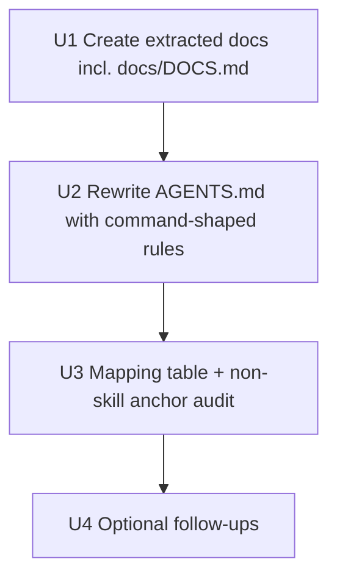

# docs(cli): consolidate AGENTS.md via progressive disclosure

## Overview

`AGENTS.md` has grown to 337 lines (~30KB) and is loaded into every agent's context for every turn in this repo (via `CLAUDE.md`'s `@AGENTS.md` include). The file mixes three distinct content kinds:

1. **Write-time rules** that must fire at the moment an agent edits code (e.g. anti-reimplementation, code & comment hygiene, commit style).
2. **Procedural runbooks** that fire only on specific operations (golden harness decision rubric, release-please flow, catalog entry validation).
3. **Pure reference / glossary** material that agents look up on demand (the canonical-term table, local artifact layout, public library flow).

This plan extracts the *body* of (2) and (3) into dedicated `docs/` files. It does **not** move the *load-bearing rules* that fire at the moment of an action — those stay inline. Every extracted section is replaced by a short, command-shaped inline rule that retains the prohibitions, file paths, and validation values an agent needs at write-time, plus a pointer to the new doc for the longer rubric/flow.

This is a deliberate revision after a codex review (REQUEST CHANGES, 8 findings). Earlier draft would have weakened or moved write-time rules out of agents' line of sight; this revision keeps them inline.

Target shape: `AGENTS.md` shrinks from 337 → ~210 lines, with no rule, file path, validation value, or prohibition removed from the inline file.

---

## Problem Frame

Two forces are in tension:

- **Context economy.** Every line of `AGENTS.md` is paid for on every turn. A 337-line preamble dilutes attention on the rules that matter most for the change in front of the agent. The glossary alone is ~57 lines of lookup material that fires when someone asks "what does *manuscript* mean?" — not when an agent is editing a template.
- **Locality of rules.** `AGENTS.md` itself contains the rule *"Make rules applicable at the moment they fire."* A rule split into a separate file only works if the inline section retains everything the agent needs to *not act wrongly* — file paths, prohibitions, validation values — and the pointer leads to the longer flow/rubric. A vague "see `docs/...`" pointer is worse than the inline rule it replaced.

The right consolidation keeps short, write-time-applicable rules inline (including their concrete file paths and prohibitions) and extracts long, situational, or lookup-shaped content — only when paired with a command-shaped inline rule.

---

## Requirements Trace

- R1. No information present in `AGENTS.md` today is lost after the split. Every prohibition, file path, validation value, and pointer either stays inline or appears verbatim/tightened in its destination file. The PR description carries a paragraph-level mapping table from old `AGENTS.md` to (new `AGENTS.md` ∪ extracted files); a missing mapping blocks merge.
- R2. Every extracted section is replaced inline by a **command-shaped rule**, not a bare pointer. A command-shaped rule names the trigger condition, the prohibition or required action, the concrete file paths or values involved, and ends with a pointer to the longer flow/rubric.
- R3. Write-time-fire rules stay inline in full: Machine vs Printed CLI, Anti-reimplementation, Agent-Native Surface, Build/Test/Lint, Project Structure (with new pointers added to its bullet list), Commit Style, Testing, Quality Gates one-liner, Code & Comment Hygiene, Internal Skills install (short and one-time but stays inline because it's 6 lines and pulling it out doesn't save context worth the indirection cost).
- R4. Long rubrics, flows, and rationales are extracted: Golden Output Harness decision rubric and fixture-author guide, release-please / goreleaser flow narrative, catalog validation rationale and `internal/catalog` cross-link, Local Artifacts + Public Library narrative, Glossary table.
- R5. The following rules/values stay inline even when their owning section is otherwise extracted:
  - **Golden:** the full enumerated trigger list ("CLI command output, catalog rendering, browser-sniff or crowd-sniff output, generated specs or generated printed CLI files, templates under `internal/generator/templates/`, naming, endpoint derivation, auth emission, manifest generation, scorecard output, or pipeline artifacts") and the rule "never update goldens just to make a failing check pass."
  - **Versioning:** the prohibition "Never manually edit version numbers" and the **two** file paths that carry the plugin version (`.claude-plugin/plugin.json` → `version`, `internal/version/version.go` → `var Version` annotated `x-release-please-version`) and the test names (`TestVersionConsistencyAcrossFiles`, `TestMarketplaceJSONHasNoPluginVersion`). **`marketplace.json` does *not* carry a plugin version** — `TestMarketplaceJSONHasNoPluginVersion` (`internal/cli/release_test.go:81`) fails if a reviewer re-adds one. The current `AGENTS.md` text claiming three version files is stale; this plan corrects it inline rather than propagating the staleness.
  - **Catalog:** the required-fields list, the wrapper-only carve-out, the HTTPS rule, the allowed `category` enum (the public categories from `internal/catalog/catalog.go:19`), the allowed `tier` enum, and the "rebuild the binary after editing" requirement. The validator additionally accepts `example` as a test-only catch-all category — the inline rule names it explicitly and instructs not to use it for real entries. The current `AGENTS.md` omits `example` and treats `spec_url`/`spec_format` as unconditional; the validator (`internal/catalog/catalog.go:219`) makes them conditional on the entry not being wrapper-only (`wrapper_libraries` set, `spec_url` empty). This plan corrects both omissions to match the validator.
  - **Glossary:** the canonical-naming command — *"use canonical terms; in skills and user-facing output use 'the Printing Press' (never 'the machine'); ask before acting on ambiguous user phrasing"* — plus the four disambiguation defaults (library / publish / manifest / catalog).
- R6. Internal cross-references in `AGENTS.md` (e.g., the "Editing AGENTS.md" section's reference to "Code & Comment Hygiene") continue to resolve correctly.
- R7. Skills, code comments, and other docs that quote glossary terms or canonical names keep working without edits.
- R8. The `CLAUDE.md` → `@AGENTS.md` include keeps working.
- R9. Pointer-rot is prevented: when an extracted doc's applicability changes (a new fire condition added, a fire condition removed, a prohibition value changes), the inline trigger sentence in `AGENTS.md` is updated in the same PR. This rule lives in the new doc-authoring file (see U1).

---

## Scope Boundaries

- In scope: reorganization of `AGENTS.md` and creation of new files under `docs/`.
- In scope: updating cross-references inside `AGENTS.md` and adding command-shaped inline rules with pointer suffixes.
- In scope: correcting factual staleness items in the current `AGENTS.md` while authoring the new inline specimens, **only where the corrected statement is enforced by code or tests in this repo**. Three corrections are in scope:
  1. Versioning: "three files" → two files + "no version in `marketplace.json`" prohibition. Enforced by `internal/cli/release_test.go:57` (`TestVersionConsistencyAcrossFiles`) and `:81` (`TestMarketplaceJSONHasNoPluginVersion`).
  2. Catalog enum: add `example` as test-only catch-all. Enforced by `internal/catalog/catalog.go:37`.
  3. Catalog required fields: `spec_url` and `spec_format` are required only when `wrapper_libraries` is empty. Enforced by `internal/catalog/catalog.go:219`.
- Out of scope: rewriting the substance of any rule. Tightening prose and aligning a stale fact with the code/test that already enforces it are allowed; changing what a rule *says* is not. Factual corrections that lack a code/test enforcer are also out of scope — they belong in a separate review pass, not this docs split.
- Out of scope: changes to `CLAUDE.md` (which only contains `@AGENTS.md`), skills, templates, or generator code. Docs-only PR.
- Out of scope: deleting glossary entries or pruning stale entries. A separate review can prune; this plan moves intact.
- Out of scope: any audit or change inside `skills/`. Skill-file scanning is deferred to U4 follow-up so this PR does not need to read or rewrite skill content. Skill quotations of `AGENTS.md` prose, if any, remain valid because the inline rules they would have quoted remain inline.

---

## Context & Research

### Current AGENTS.md sections and disposition (line ranges as of 5bc7390)

| # | Section | Lines | Fires when | Disposition |
|---|---|---|---|---|
| 1 | Machine vs Printed CLI | 3–17 | every change | stay |
| 1a | Anti-reimplementation | 19–38 | adding/touching novel commands | stay |
| 2 | Agent-Native Surface | 40–78 | touching MCP / Cobra annotations | stay |
| 3 | Build, Test & Lint | 80–93 | every change | stay |
| 4 | Golden Output Harness | 95–125 | template/output changes | **split**: trigger list + "never update to make it pass" rule stay inline; rubric/fixtures/decision-tree → `docs/GOLDEN.md` |
| 5 | Project Structure | 127–140 | quick reference | stay; bullet list extended with new doc paths |
| 6 | Glossary | 142–198 | naming + ambiguous user phrasing | **split**: canonical-naming command + 4 disambiguation defaults stay inline; full term table → `docs/GLOSSARY.md` |
| 7 | Commit Style | 200–226 | at commit / PR creation | stay |
| 8 | Versioning & Release | 228–241 | release flow / version files | **split**: "never edit version numbers" + 2 version file paths + both test names + "no version in marketplace.json" prohibition stay inline; release-please flow → `docs/RELEASE.md` |
| 9 | Adding Catalog Entries | 243–249 | adding `catalog/*.yaml` | **split**: required fields + HTTPS rule + category/tier enums + rebuild rule stay inline; longer narrative + validation rationale → `docs/CATALOG.md` |
| 10 | Testing | 251–257 | every code change | stay |
| 11 | Quality Gates | 259–261 | one-liner reference | stay |
| 12 | Local Artifacts | 263–273 | discussions of file location | extract → `docs/ARTIFACTS.md` |
| 13 | Public Library | 275–286 | publish-related work | extract → `docs/ARTIFACTS.md` |
| 14 | Internal Skills | 288–298 | one-time skill install | **stay**: 6 lines, no extraction win |
| 15 | Skill Authoring | 300–304 | when machine change touches a skill | stay (already a pointer) |
| 16 | Code & Comment Hygiene | 306–324 | every code write + diff review | stay |
| 17 | Editing AGENTS.md | 326–333 | editing this file | extract → `docs/DOCS.md` (NEW) |
| 18 | Patterns | 335–337 | designing cross-cutting workflows | stay (already a pointer) |

### Existing `docs/` files

`docs/PIPELINE.md`, `docs/SPEC-EXTENSIONS.md`, `docs/SKILLS.md`, `docs/PATTERNS.md` are the prior art — each is a focused doc that `AGENTS.md` already points to with a one-liner. New files extend the same pattern.

### Constraints already in AGENTS.md that this plan must respect

- *"Make rules applicable at the moment they fire."* → write-time rules stay inline; only flows/rubrics/lookup material extract.
- *"Don't defend the doc's structure inside the doc."* → `AGENTS.md` will not contain a "we split this because…" section. The plan itself is the justification.
- *"Examples should be generic or anti-pattern-shaped."* → extracted files keep existing examples; we add no new incident-tied examples.
- *"No dates, incidents, or ticket numbers in rules."* → applies to new files. Note: some current glossary entries already violate this ("introduced April 2026"); preserved as-is, flagged for U4 follow-up.

---

## Key Technical Decisions

- **Inline keeps the *command*; extracted file keeps the *flow*.** This is the central revision after codex review. Examples:
  - Golden: inline keeps the full list of fire conditions and the prohibition against updating goldens to mask a failure. Extracted keeps the decision rubric, fixture-add procedure, and verify-failure recovery.
  - Versioning: inline keeps "never edit by hand," the **two** version file paths, both relevant test names, and the explicit prohibition on adding a `version` to `marketplace.json` plugin entries. Extracted keeps the release-please/goreleaser flow narrative. (Note: the current `AGENTS.md` says "three files" — that text is stale against `release_test.go:81`. The inline specimen above is the corrected version.)
  - Catalog: inline keeps the required-fields list with the wrapper-only carve-out, HTTPS, the public `category` enum, the `tier` enum, the `example`-is-test-only carve-out, and the rebuild requirement. Extracted keeps validation rationale, the longer narrative on why these constraints exist, and the full wrapper-only entry shape.
  - Glossary: inline keeps the naming command and the four disambiguation defaults. Extracted keeps the term table.
- **`docs/DOCS.md` is a new file, not an append to `docs/SKILLS.md`.** Doc-authoring rules and skill-authoring rules have different audiences. Mixing them turns `docs/SKILLS.md` into a junk drawer. New `docs/DOCS.md` covers: editing-AGENTS.md rules + pointer-rot rule (R9).
- **Internal Skills install stays inline.** Six lines. Pulling it out costs more in indirection than it saves in context. The previous draft moved it to `docs/SKILLS.md` mainly to share a destination with editing-AGENTS.md; with `docs/DOCS.md` taking the latter, internal-skills install no longer has a natural co-located destination, so it stays.
- **Local Artifacts + Public Library merge into `docs/ARTIFACTS.md`.** Same conceptual axis (where do printed CLIs live, local vs. public). One file beats two for this content. Project Structure gets a one-line pointer.
- **No skill audit in this PR.** The earlier draft's `grep -rn "AGENTS.md" skills/` step would have read skill content, which is out of scope. Skill-quote audit moves to U4 (optional human-driven follow-up). Skills should remain valid because the inline rules they could have quoted are still inline.
- **No changes to extracted prose beyond tightening duplicated phrasing.** If two paragraphs say the same thing in slightly different words, the extracted file gets the clearer version. Substantive content stays.
- **The mapping table is a merge gate.** R1 requires a paragraph-level mapping table in the PR description showing every chunk of the old `AGENTS.md` → its destination. No mapping = no merge. Audit is operationalized, not aspirational.

---

## Open Questions

### Resolved during planning

- **Q: Should the glossary stay fully inline because canonical naming fires constantly?** No. The naming *command* fires constantly (use "printed CLI" not "the CLI"; use "the Printing Press" in user-facing output) and stays inline. The lookup of unfamiliar terms (manuscript, regen-merge, side-effect command convention, etc.) fires rarely and moves to `docs/GLOSSARY.md`.
- **Q: Should this be one combined `docs/AGENTS-EXTRAS.md` instead of multiple files?** No. One-purpose files match the prior art and let pointers be specific. Grab-bag forces vague pointers.
- **Q: Should `docs/SKILLS.md` absorb editing-AGENTS rules and internal-skills install?** No. Different audiences. New `docs/DOCS.md` for doc-authoring; internal-skills install stays inline.
- **Q: Should the U3 audit grep `skills/`?** No. Out of scope for this PR. U4 follow-up.
- **Q: Does this risk breaking external links into `AGENTS.md` anchors?** Low risk inside this repo (a quick grep before merge confirms callers, scoped to non-skill paths). External pins to GitHub anchors are not a supported contract.
- **Q: Should the inline catalog rule duplicate the values that live in `internal/catalog`'s validator?** Yes. Validation in code is the source of truth, but the inline rule is a write-time-applicable fence for an agent who hasn't read the validator yet. The `docs/CATALOG.md` cross-link to `internal/catalog` keeps them traceable.

### Deferred to implementation

- Exact wording of inline command-shaped rules. The plan specifies the structure (trigger / prohibition or action / concrete values / pointer); the implementing change picks phrasing.
- Whether the inline glossary stub uses bullet form or paragraph form for the naming command. Picked at implementation time.
- Whether `docs/ARTIFACTS.md` opens with Local Artifacts or Public Library first. Local → public is the flow direction; user-facing question is more often public → local. Implementer picks.

---

## High-Level Technical Design

> *Directional guidance for review. The implementing agent should treat it as context, not exact prose to reproduce.*

### Final AGENTS.md shape (target ~210 lines)

```
# CLI Printing Press - Development Conventions

## Machine vs Printed CLI                     [stay]
### Anti-reimplementation                     [stay]

## Agent-Native Surface                       [stay]
### Default: expose; skip rules are exceptions
### Tool safety annotations
### Typed exit-code verification

## Build, Test & Lint                         [stay]

## Generator output stability                 [NEW: ~6 lines — full trigger list + "never update to mask" rule + pointer to docs/GOLDEN.md]

## Project Structure                          [stay; bullet list extended]
- ... existing entries ...
- docs/GLOSSARY.md   - Canonical terms, full disambiguation table
- docs/GOLDEN.md     - Golden harness decision rubric and fixture conventions
- docs/RELEASE.md    - release-please / goreleaser flow
- docs/CATALOG.md    - Catalog entry validation rationale
- docs/ARTIFACTS.md  - Local library, manuscripts, public library
- docs/DOCS.md       - Doc-authoring rules (editing AGENTS.md, pointer-rot rule)

## Naming and disambiguation                  [NEW: ~7 lines — naming command + 4 disambiguation defaults + pointer to docs/GLOSSARY.md]

## Commit Style                               [stay]

## Versioning                                 [NEW: ~6 lines — "never edit by hand" + 2 version file paths + both test names + "no version in marketplace.json" prohibition + pointer to docs/RELEASE.md]

## Adding Catalog Entries                     [NEW: ~6 lines — required fields + HTTPS + category enum + tier enum + rebuild rule + pointer to docs/CATALOG.md]

## Testing                                    [stay]

## Quality Gates                              [stay; one-liner]

## Local Artifacts                            [NEW: ~3 lines — paths only + pointer to docs/ARTIFACTS.md]

## Internal Skills                            [stay; 6 lines]

## Skill Authoring                            [stay; already a pointer]

## Code & Comment Hygiene                     [stay]
### Write-time defaults
### Pre-commit: scan the diff

## Editing AGENTS.md                          [REPLACED by 2-line pointer to docs/DOCS.md]

## Patterns                                   [stay; already a pointer]
```

### New files

- **`docs/GOLDEN.md`** — decision rubric (No-update / Update existing / Add or expand), how to add fixtures, fixture-quality guidance, verify-failure recovery, relationship to `go test` / lint / build. The list of fire conditions and the prohibition stay inline in `AGENTS.md`.
- **`docs/GLOSSARY.md`** — full term table (lines 159–198 of current `AGENTS.md`) plus the longer naming-context paragraphs (lines 144–152). The naming command and four disambiguation defaults stay inline.
- **`docs/RELEASE.md`** — release-please flow (3 numbered steps), goreleaser behavior, what merging the release PR triggers. The prohibition + 2 version file paths + both test names + "no version in marketplace.json" rule stay inline.
- **`docs/CATALOG.md`** — validation rationale, the link to `internal/catalog`, narrative on why categories/tiers exist. The required fields, HTTPS rule, allowed enums, and rebuild rule stay inline.
- **`docs/ARTIFACTS.md`** — Local Artifacts (lines 263–273) + Public Library (lines 275–286), in `local → public` narrative order. Inline keeps just the path skeleton.
- **`docs/DOCS.md`** — NEW. Editing-AGENTS.md rules (current lines 326–333) + pointer-rot rule (R9): *"When an extracted doc's applicability changes — a new fire condition, a removed condition, a changed prohibition value — update the inline trigger in `AGENTS.md` in the same PR."*

### Specimen inline rules (structure shown; final wording deferred)

**Golden (~6 lines inline):**
> Run `scripts/golden.sh verify` whenever a change may affect CLI command output, catalog rendering, browser-sniff or crowd-sniff output, generated specs or generated printed CLI files, templates under `internal/generator/templates/`, naming, endpoint derivation, auth emission, manifest generation, scorecard output, or pipeline artifacts. **Never update goldens just to make a failing check pass.** Run `scripts/golden.sh update` only when the behavior change is intentional, then explain the diff in your final response. See `docs/GOLDEN.md` for the decision rubric (No-update / Update / Add) and how to author fixtures.

**Versioning (~6 lines inline):**
> Releases are automated by release-please. **Never manually edit version numbers.** The plugin version lives in exactly **two** places and must stay in sync: `.claude-plugin/plugin.json` → `version`, and `internal/version/version.go` → `var Version` (annotated `x-release-please-version`; goreleaser injects via ldflags). `TestVersionConsistencyAcrossFiles` (`internal/cli/release_test.go`) fails if they drift. **Do not add a `version` field to `marketplace.json` plugin entries** — `TestMarketplaceJSONHasNoPluginVersion` fails on that. See `docs/RELEASE.md` for the merge-the-release-PR flow.

**Catalog (~8 lines inline):**
> When adding or editing `catalog/*.yaml`, the entry must pass `internal/catalog` validation. Required fields: name, display_name, description, category, tier — plus `spec_url` and `spec_format` *unless* the entry is wrapper-only (`wrapper_libraries` is set and `spec_url` is omitted). `spec_url` (when present) must use HTTPS. `category` must be one of: ai, auth, cloud, commerce, developer-tools, devices, food-and-dining, marketing, media-and-entertainment, monitoring, payments, productivity, project-management, sales-and-crm, social-and-messaging, travel, other. `tier` must be `official` or `community`. (The validator additionally accepts `example` as a test-only catch-all — do not use it for real catalog entries.) Rebuild the binary after editing — `catalog.FS` is a Go embed. See `docs/CATALOG.md` for validation rationale and the wrapper-only entry shape.

**Glossary (~7 lines inline):**
> Use canonical terms in your responses so intent stays unambiguous. In skills and user-facing output (GitHub issues, retro documents, confirmation prompts), use **"the Printing Press"** as the system name — never "the machine." Subsystem names (generator, scorer, skills, binary) are fine alongside it. When user phrasing is ambiguous and the distinction affects what action to take, ask before acting. Most-confused defaults: "library" → local library; "publish" → the publish step (pipeline) unless explicitly the public-library workflow; "manifest" → `tools-manifest.json`; "catalog" → embedded `catalog/`. See `docs/GLOSSARY.md` for the full term table and disambiguation cases.

---

## Implementation Units



- **U1. Create the six extracted docs.**
  - `docs/GOLDEN.md`, `docs/GLOSSARY.md`, `docs/RELEASE.md`, `docs/CATALOG.md`, `docs/ARTIFACTS.md`, `docs/DOCS.md`.
  - `docs/DOCS.md` includes the pointer-rot rule (R9) explicitly.
  - Each new file: short header, the moved content verbatim or tightened, no editorial restructuring.
  - **Done when:** every paragraph extracted from `AGENTS.md` lines 95–125, 142–198, 228–249, 263–286, 326–333 has a home, and `docs/DOCS.md` includes the pointer-rot rule.

- **U2. Rewrite AGENTS.md with command-shaped inline rules.**
  - Replace each extracted section with a command-shaped rule per the specimens above.
  - Each inline rule: trigger / prohibition or action / concrete values / pointer suffix.
  - Extend Project Structure's bullet list with the six new doc paths.
  - **Done when:** AGENTS.md is ≤220 lines, every extracted section has a command-shaped inline replacement (not a bare pointer), and every prohibition / file path / enum / test name listed in R5 appears inline.

- **U3. Mapping table + non-skill anchor audit.**
  - Produce a paragraph-level mapping table in the PR description: every paragraph of old `AGENTS.md` → its destination (new `AGENTS.md` section heading or extracted file path).
  - Run `grep -rn "AGENTS.md#" docs/ catalog/ cmd/ internal/` (deliberately scoped to non-skill paths) to surface anchor-based links the rename might break.
  - Run `grep -rn "in AGENTS.md" docs/ catalog/ cmd/ internal/` (same scoping) for prose references that should now point to a sub-doc.
  - **Done when:** the mapping shows zero unaccounted paragraphs, no broken in-repo non-skill anchors, and the table is committed in the PR description.

- **U4. Optional follow-ups (not in this PR).**
  - Skill-quote audit: run `grep -rn "AGENTS.md\|the machine" skills/` once a human can decide which quotations to update; do this only if a real bug is reported.
  - Tighten glossary entries that contain dates / incidents — currently violate the no-dates rule; flagged but out of scope here.
  - Add a `docs/README.md` index of the developer-doc files.

---

## Risks and Mitigations

- **Risk: pointer sentences drift toward generic "see docs/X" over time, defeating the locality goal.** Mitigation: `docs/DOCS.md` includes both the pointer-rot rule and a structural rule for command-shaped inline rules (trigger / prohibition / values / pointer). The Code & Comment Hygiene "diff-review" section already covers similar shapes for code; the doc-authoring rule mirrors it for docs.
- **Risk: an extracted doc gains a new fire condition and the inline trigger in `AGENTS.md` doesn't get updated.** Mitigation: R9 + pointer-rot rule in `docs/DOCS.md` explicitly require same-PR updates. Reviewers enforce.
- **Risk: glossary entries with embedded dates ("introduced April 2026") get moved verbatim and now violate the no-dates rule in their new home.** Mitigation: explicitly out of scope for this plan; flagged as U4 follow-up. The current `AGENTS.md` already has this issue; moving it doesn't make it worse.
- **Risk: future agents quote "AGENTS.md says X" for X that now lives in `docs/`.** Mitigation: low-impact; the content is still in the repo and discoverable. The inline command-shaped rule in `AGENTS.md` retains the load-bearing parts most likely to be quoted.
- **Risk: mapping table is treated as a formality and waved through.** Mitigation: R1 makes "missing mapping = merge blocked" explicit. Reviewer must verify each row.
- **Risk: the split makes onboarding harder because newcomers must follow more pointers.** Mitigation: the inline file is shorter and more scannable; command-shaped rules name triggers so a reader knows whether to follow or skip; `docs/DOCS.md` lists the developer-doc files.

---

## Validation

- After U2, `wc -l AGENTS.md` reports ≤220 lines.
- After U2, a manual scan confirms each item in R5 (golden trigger list, version file paths/test, catalog enums/HTTPS/rebuild, glossary naming command + defaults) appears verbatim or tightened inline.
- After U3, the mapping table in the PR description shows a 1-to-1 paragraph mapping from old AGENTS.md to (new AGENTS.md ∪ extracted files); zero unaccounted paragraphs.
- The non-skill anchor audit grep returns no broken links into AGENTS.md anchors that pointed to extracted sections.
- Manual read-through: open the new AGENTS.md and read top-to-bottom; every command-shaped inline rule lets a reader decide "do I need to follow this link right now?" without ambiguity.
- No code, tests, or skills change. `go test ./...` and `scripts/golden.sh verify` are unaffected.

---

## Codex Review Disposition

### First review (REQUEST CHANGES, 8 findings)

1. **Golden trigger too narrow.** → R5 + specimen inline rule retains the full enumerated trigger list.
2. **Version rule fires too late.** → R5 + specimen retains "never edit by hand" + version file paths + test name inline; only flow extracted.
3. **Catalog trigger needs to be command-shaped.** → R5 + specimen retains required fields + HTTPS + enums + rebuild rule inline.
4. **U3 violates skill-files boundary.** → U3 grep scoped to `docs/ catalog/ cmd/ internal/`; skill-quote audit deferred to U4 follow-up.
5. **`docs/SKILLS.md` becoming a junk drawer.** → New `docs/DOCS.md` for doc-authoring; internal-skills install stays inline.
6. **Glossary inline stub must preserve naming command.** → R5 + specimen retains the canonical-naming command alongside the 4 defaults.
7. **"No content is dropped" not operationalized.** → R1 elevates the mapping table to a merge gate, not an informal U3 step.
8. **Pointer-rot risk missed.** → R9 + pointer-rot rule lives in `docs/DOCS.md` (created in U1).

### Second review (REQUEST CHANGES, 3 new findings — all addressed)

1. **Version specimen is wrong against current tests.** Current `AGENTS.md` claims three version files including `marketplace.json → plugins[0].version`, but `internal/cli/release_test.go:81` (`TestMarketplaceJSONHasNoPluginVersion`) fails if any plugin entry declares `version`. Earlier draft would have copied the stale claim forward. → Scope expanded to permit aligning a stale fact with the test that already enforces it. R5 now specifies **two** files (plugin.json + version.go) and adds the explicit "do not add `version` to `marketplace.json`" prohibition, plus both relevant test names. Specimen rewritten.
2. **Catalog enum specimen is imprecise.** `internal/catalog/catalog.go:37` accepts `example` as a test-only catch-all (used by `catalog/petstore.yaml`); current `AGENTS.md` omits it. → R5 now names the public categories from the validator and explicitly notes `example` as test-only-do-not-use. Specimen updated.
3. **R4 vs R5 contradiction.** R4 said "category/tier value list" was extracted while R5 said allowed enums stay inline. → R4 reworded to "validation rationale and `internal/catalog` cross-link" — values stay inline, rationale extracted. No contradiction.

### Third review (REQUEST CHANGES, 1 partial + 1 new finding — all addressed)

1. **PARTIALLY RESOLVED: version specimen.** The actual specimen rule was correct (two files, both tests) but three internal plan references still said "3 file paths + test name" — disposition table, target shape sketch, new-file summary. → Updated all three sites to "2 version file paths + both test names + 'no version in marketplace.json' prohibition." Stale planning text was the exact failure mode codex first warned about.
2. **NEW: catalog required-fields rule was still stale.** `internal/catalog/catalog.go:219` shows `spec_url` and `spec_format` are conditional on the entry not being wrapper-only (`wrapper_libraries` set, `spec_url` empty). Earlier specimen treated them as unconditional. → Specimen rewritten to make `spec_url`/`spec_format` conditional on the wrapper-only carve-out. R5 expanded. Scope-Boundaries section now lists three corrections (versioning, catalog enum, catalog required-fields), each with its enforcing test/code line, and explicitly states that factual corrections without a code/test enforcer are out of scope.
