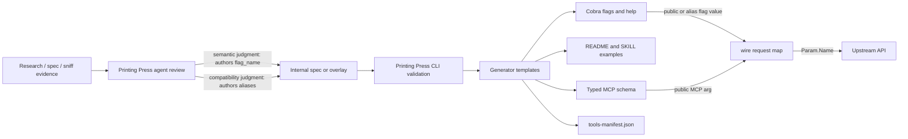

# feat(cli): Agent-authored public names for API parameters

## Overview

Generated endpoint commands currently use one value, `spec.Param.Name`, for two different jobs: the upstream wire key and the public CLI/MCP/docs parameter name. That is fine for well-named API params like `limit`, but it produces poor agent-facing surfaces for APIs with cryptic wire keys such as `s` and `c`.

Add an explicit public parameter name model so the Printing Press agent can choose semantic names during spec enrichment while the generator keeps requests wired to the original API keys. The machine owns validation and rendering consistency; the agent owns the semantic naming judgment.

The feature is the handoff between those two halves, not just a new field. The Printing Press skill must teach an agent how to decide that a cryptic wire key like `s` means `address` for one endpoint, while the Printing Press CLI must make that agent-authored decision durable and carry it through every generated surface without guessing the meaning itself.

---

## Problem Frame

Issue #642 is valid, but `aliases` alone is not enough if README/SKILL/help/MCP should prefer the friendlier name. A plain alias lets `--address` work, but leaves the canonical generated surface as `--s`, and typed MCP would still ask agents for `s`.

The desired contract is:

- `name`: upstream wire key, e.g. `s`
- `flag_name`: preferred public CLI/MCP/docs name, e.g. `address`
- `aliases`: optional compatibility spellings accepted by Cobra, e.g. `[s]`

Choosing `address` is not deterministic string cleanup. It depends on endpoint context, parameter descriptions, browser-sniff interaction evidence, SDK/source evidence, and product judgment. A deterministic rule might choose `street-address` or `search` and be wrong. The Printing Press skill should therefore inspect cryptic params and author `flag_name` only when the evidence supports it.

---

## Requirements Trace

- R1. Specs can express a public parameter name without changing the upstream wire key.
- R2. Cobra flags, generated help, examples, README/SKILL surfaces, typed MCP schemas, and `tools-manifest.json` prefer the public name when present.
- R3. Request construction still uses the original wire `Param.Name` for query/path/body keys.
- R4. Optional aliases bind to the same Cobra backing variable as the public flag. Aliases are public CLI spellings; a raw wire key may be used as an alias only when it is already a valid public flag name.
- R5. Validation rejects invalid public names and collisions across public names, aliases, body flags, endpoint params, and generator-reserved flags.
- R6. The Printing Press skill guides the agent to author `flag_name` from evidence during spec enrichment; the machine does not auto-infer semantic names.
- R7. Tests prove both public and alias flags route to the same wire key, and MCP/public manifests expose the public name while remapping back to the wire key.
- R8. Verification covers the full skill-to-generator loop: a skill-style enriched spec or overlay containing agent-authored `flag_name` values produces friendly CLI flags, generated README/SKILL examples, typed MCP inputs, and manifest metadata while preserving wire keys.

---

## Scope Boundaries

- This is a generator/spec/skill change, not a hand patch to a printed CLI.
- Public naming applies first to flag-backed endpoint params and body fields. Positional placeholder naming can use the same model where practical, but CLI positional aliasing is out of scope.
- No global dictionary of cryptic names. `s` must not automatically become `address`, because it may mean search, state, status, sort, start, or street depending on context.
- No automatic rewrite of upstream OpenAPI files. For official specs, the agent should apply public names through the existing overlay/enrichment path or generated internal spec artifacts.
- No public-library backfill in this plan. Existing printed CLIs benefit when regenerated or explicitly patched later.
- No new OpenAPI `x-` extension is required for the first implementation. It can be added later if catalog-owned annotated OpenAPI specs need first-class support.

### Deferred to Follow-Up Work

- Library-wide audit/backfill of already-printed CLIs with cryptic flags.
- Richer positional placeholder display and alias support beyond MCP remapping.
- Optional OpenAPI extension support such as `x-pp-flag-name` / `x-pp-aliases` if sidecar overlays prove insufficient.

---

## Context & Research

### Relevant Code and Patterns

- `internal/spec/spec.go` defines `Param` and already has internal-only `IdentName`, proving the generator can separate wire identity from generated identifiers.
- `internal/generator/flag_collision.go` dedupes Go identifiers and Cobra flag names while preserving wire-side serialization.
- `internal/generator/templates/command_endpoint.go.tmpl` and `internal/generator/templates/command_promoted.go.tmpl` register endpoint/body flags and perform required/enum/JSON checks against one generated flag name today.
- `internal/generator/generator.go` owns template helpers such as `flagName`, `paramIdent`, `exampleLine`, and JSON enum suggestions.
- `internal/generator/templates/mcp_tools.go.tmpl` currently exposes typed MCP inputs using `.Name` and passes raw argument maps directly to the API handler.
- `internal/pipeline/toolsmanifest.go` serializes manifest params using a single `Name` field today.
- `internal/pipeline/overlay.go` and `internal/pipeline/merge.go` provide the existing spec enrichment path, but `ParamPatch` currently only supports defaults.
- `skills/printing-press/SKILL.md` owns the agent workflow for printing CLIs from research/sniff/crowd-sniff inputs.
- `skills/printing-press/references/spec-format.md` documents the internal YAML spec shape.
- `docs/SKILLS.md` states the intended split: deterministic substrate belongs in Go/templates; `SKILL.md` should reserve agentic review for semantic judgment.

### Institutional Learnings

- `docs/solutions/design-patterns/auth-envvar-rich-model-2026-05-05.md` is the closest design pattern: widen a legacy scalar/list into a richer model, centralize precedence, and stop downstream surfaces from re-deriving semantics independently.
- Prior generator plans around MCP parity and param handling show that deterministic generated surface changes need focused unit tests plus golden verification when output changes.

### Affected Printed CLI Evidence

Domino's is the canonical real-world affected CLI:

- `~/Code/printing-press-library/library/food-and-dining/dominos/spec.yaml` keeps the store-locator wire params as `s` and `c`, with descriptions that clearly identify them as street address and city/state/zip.
- `internal/cli/stores_find.go` was manually back-patched after generation to expose public `--address` / `--city` flags, keep hidden `--s` / `--c` compatibility aliases, and still send `params["s"]` / `params["c"]` upstream.
- `README.md` and `SKILL.md` examples already teach users and agents to call `dominos-pp-cli stores find --address ... --city ...`.
- `internal/mcp/tools.go` still exposes typed MCP inputs named `s` and `c`, and the tool description says `Required: s, c`. This proves a Cobra-only alias implementation is insufficient; the generator must propagate public names through typed MCP schemas and remap those public inputs back to wire keys.
- No checked-in `tools-manifest.json` exists in that Domino's directory, but the same manifest drift would occur today because `internal/pipeline/toolsmanifest.go` writes params from the single raw `Name` field.

### Skill / Generator Contract

The intended loop is:

1. The Printing Press skill gathers evidence during research, browser-sniff, crowd-sniff, SDK/source inspection, and endpoint workflow review.
2. The agent uses that evidence to author semantic public names into the enrichment artifact: `flag_name` for the preferred public name, and `aliases` only for compatibility spellings.
3. The Printing Press CLI validates that authored data and rejects invalid or colliding public surfaces. It must not infer semantic names from descriptions, examples, or global dictionaries.
4. The generator renders the authored public names through CLI help, generated README/SKILL examples, typed MCP schemas, and `tools-manifest.json`.
5. Runtime request construction continues to use the original wire key from `name`.

The Domino's store-locator example shows the reasoning path the skill should teach. The agent does not choose `address` and `city` because `s` and `c` have universal meanings. It chooses them from endpoint-local evidence:

- The endpoint path is `/power/store-locator`, and the endpoint description is "Find nearby Domino's stores by address", so the params are part of a location-search workflow.
- The `s` parameter description is `Street address (e.g., "350 5th Ave")`, which disambiguates `s` from search, state, status, sort, or start.
- The `c` parameter description is `City, state, zip (e.g., "New York NY 10118")`, which disambiguates `c` from category, country, count, or currency.
- README/SKILL examples and the hand-patched CLI already express the user workflow as `stores find --address ... --city ...`, confirming that concise task-level names fit the surface better than literal names like `street-address` or `city-state-zip`.

From that evidence, the target shape is:

```yaml
params:
  - name: s
    flag_name: address
    aliases: [s]
    description: Street address
  - name: c
    flag_name: city
    aliases: [c]
    description: City, state, zip
```

The agent-authored improvement is `flag_name: address` and `flag_name: city`. The `aliases` entries are compatibility only. If evidence is unclear, the skill must leave `flag_name` unset rather than letting the generator invent a friendly name.

### External References

- No external research needed. This is repo-local generator behavior and Printing Press workflow design.

---

## Key Technical Decisions

- **Use `flag_name` as the preferred public field name.** `aliases` are secondary accepted spellings. This keeps the model explicit: `name` is wire, `flag_name` is public, `aliases` are compatibility.
- **The agent chooses `flag_name`; the machine validates and propagates it.** The machine can surface cryptic params for review, but it must not infer semantic names automatically.
- **Prefer public names everywhere agents discover the surface.** Help, command examples, typed MCP schemas, tools manifest params, README examples that include flags, and generated SKILL content should all use `flag_name` when present.
- **Keep `IdentName` internal.** It remains a collision/dedup artifact and should not become the authored public-name mechanism.
- **Reject authored public-name collisions instead of silently deduping them.** A user-authored `flag_name: address` must remain `--address`; if it collides, the spec/overlay should fail fast so the agent can choose a better name.
- **MCP has one public input name, not alias inputs.** Cobra can accept aliases. Typed MCP should expose the preferred public name and remap it to the wire key internally.
- **Tools manifest names become public names, with wire metadata added.** Manifest consumers should see agent-friendly names while retaining enough metadata to route correctly and debug wire behavior.

---

## Open Questions

### Resolved During Planning

- **Should `aliases` alone solve this?** No. Aliases alone leave the canonical agent-facing surfaces as cryptic wire names.
- **Should the machine infer `flag_name` from descriptions?** No. It may detect cryptic candidates, but final naming is agent-authored semantic judgment.
- **Should raw wire keys be aliases by default?** No. The agent should add `aliases: [s]` when a raw spelling is useful and already valid as a CLI flag. Raw API names that are not valid lowercase kebab-case flags need an explicit public compatibility spelling or no alias.
- **Should this apply to body fields too?** Yes for the model and generator plumbing, because body fields are also Cobra flags and MCP inputs. The Printing Press skill can initially focus review on query params surfaced by issue #642.

### Deferred to Implementation

- Exact helper naming for public-name resolution and changed-flag checks.
- Whether alias flags should be hidden in Cobra help by default. The implementation should evaluate pflag support and choose the least surprising behavior; public help must still prefer `flag_name`.
- How much of the cryptic-param review should be a new report versus a Printing Press skill checklist using existing spec artifacts.

---

## High-Level Technical Design

> *This illustrates the intended approach and is directional guidance for review, not implementation specification. The implementing agent should treat it as context, not code to reproduce.*



Example target spec shape:

```yaml
params:
  - name: s
    flag_name: address
    aliases: [s]
    description: Street address
  - name: c
    flag_name: city
    aliases: [c]
    description: City, state, zip
```

---

## Implementation Units

- U1. **Widen the parameter model and enrichment path**

**Goal:** Add public parameter naming fields to the spec model and make overlays able to author them without mutating source OpenAPI documents.

**Requirements:** R1, R4, R6

**Dependencies:** None

**Files:**
- Modify: `internal/spec/spec.go`
- Modify: `internal/pipeline/overlay.go`
- Modify: `internal/pipeline/merge.go`
- Test: `internal/spec/spec_test.go`
- Test: `internal/pipeline/merge_test.go`
- Modify: `skills/printing-press/references/spec-format.md`

**Approach:**
- Add `FlagName` and `Aliases` fields to `spec.Param` with `flag_name` / `aliases` YAML and JSON keys.
- Extend `pipeline.ParamPatch` with `FlagName *string`, `ClearFlagName bool`, and `Aliases *[]string` so enrichment overlays can set or clear public names without changing upstream spec artifacts. Tri-state semantics are explicit:
  - omitted `flag_name` with no `clear_flag_name` leaves the existing public name unchanged
  - `clear_flag_name: true` removes the existing public name
  - `flag_name: ""` is invalid, even in overlays
  - a non-empty `flag_name` sets the public name and must pass final public-name validation
  - omitted `aliases` preserves existing aliases; explicit `aliases: []` clears them
- Extend `EndpointOverlay` with a separate `body` patch list, or another collision-safe body-field patch shape, so body fields can receive `flag_name` and `aliases` through the same enrichment path as endpoint params.
- Preserve `Name` as the only wire key. Do not repurpose `IdentName`; leave it internal and unmarshal-disabled.
- Document the internal YAML fields with the explicit rule: the agent chooses `flag_name` only when source evidence makes the user-facing meaning clear.

**Patterns to follow:**
- `AuthEnvVar` rich-model widening in `internal/spec/spec.go`.
- `internal/pipeline/merge.go` patch application style for defaults.
- `skills/printing-press/references/spec-format.md` annotated field documentation style.

**Test scenarios:**
- Happy path: YAML with `name: s`, `flag_name: address`, `aliases: [s]` parses and preserves all fields.
- Happy path: JSON with the same fields parses and preserves all fields.
- Happy path: overlay patch sets `flag_name` and `aliases` for an existing param without changing `Name`.
- Happy path: overlay patch sets and clears `flag_name` / `aliases` for an existing body field without changing its body key.
- Edge case: overlay patch with omitted `flag_name` preserves the existing public name; `clear_flag_name: true` clears it; `flag_name: ""` is rejected.
- Edge case: overlay patch for an unknown param leaves the spec unchanged.
- Edge case: overlay patch with omitted `aliases` preserves existing aliases; explicit `aliases: []` clears them.

**Verification:**
- Parsed specs and overlays can carry public names through to generator input without changing wire names.

---

- U2. **Validate public names and alias collisions**

**Goal:** Reject invalid or ambiguous public surfaces before code generation.

**Requirements:** R4, R5

**Dependencies:** U1

**Files:**
- Modify: `internal/spec/spec.go`
- Modify: `internal/generator/flag_collision.go`
- Test: `internal/spec/spec_test.go`
- Test: `internal/generator/flag_collision_test.go`

**Approach:**
- Validate `flag_name` and each alias as lowercase kebab-case flag names.
- Put shape-only validation in the spec layer: empty values, invalid kebab-case, duplicate names within a single endpoint/body list, and alias equal to its own public name.
- Put full command-context validation in the generator layer, where pagination, mutating method, body-field, and async-job context is available.
- Reject aliases equal to another param/body public name, aliases equal to another alias, and public names/aliases that collide with body-field flags on the same command.
- Reject public names/aliases that collide with generator-reserved flags on that command, including pagination `all`, mutating `stdin`, and async `wait`, `wait-timeout`, `wait-interval`.
- Treat aliases as public CLI flag spellings, not guaranteed literal wire keys. Do not auto-normalize invalid raw names into aliases; the agent must author a valid compatibility spelling when compatibility is needed.
- Keep the existing generated dedup path for un-authored collisions, but do not silently rename explicit public names or aliases.

**Patterns to follow:**
- `reservedFlagNamesForEndpoint` in `internal/generator/flag_collision.go`.
- `validateFrameworkCobraCollisions` in `internal/spec/spec.go` for parse-time failure with actionable messages.

**Test scenarios:**
- Happy path: `flag_name: address`, `aliases: [s]` passes on an endpoint with no other `address` flag.
- Error path: alias equals its public `flag_name`.
- Error path: alias equals another param's wire-derived fallback flag.
- Error path: two params declare the same `flag_name`.
- Error path: one param's alias equals another param's `flag_name`.
- Error path: `flag_name: all` is rejected on a paginated endpoint.
- Error path: `flag_name: stdin` is rejected on a POST/PUT/PATCH endpoint.
- Error path: uppercase, spaces, underscores, and empty public names are rejected.
- Error path: a raw wire key such as `StartTime>` or `foo_bar` is rejected when copied literally into `aliases`; use an authored public CLI spelling such as `start-time-after` or `foo-bar` instead.
- Edge case: a cryptic `name: s` with no `flag_name` continues to generate as today.

**Verification:**
- Invalid authored public names fail before Go generation or Cobra runtime registration.

---

- U3. **Render public names through Cobra commands and docs examples**

**Goal:** Generated CLI flags, validation errors, and examples prefer `flag_name` while still accepting aliases that bind to the same variable.

**Requirements:** R2, R3, R4

**Dependencies:** U1, U2

**Files:**
- Modify: `internal/generator/generator.go`
- Modify: `internal/generator/flag_collision.go`
- Modify: `internal/generator/templates/command_endpoint.go.tmpl`
- Modify: `internal/generator/templates/command_promoted.go.tmpl`
- Test: `internal/generator/generator_test.go`
- Test: `internal/generator/json_string_validation_test.go`
- Test: `internal/generator/enum_validation_test.go`
- Test: `internal/generator/flag_collision_test.go`

**Approach:**
- Add central helpers for public flag resolution, alias lists, and "any registered flag changed" checks.
- Register the preferred public flag first, using the shared backing variable.
- Register aliases against the same backing variable. Prefer hiding aliases from help when they preserve cryptic wire keys, matching the Domino's `stores find` back-patch where `--address` / `--city` are visible and `--s` / `--c` still work but are hidden.
- Update required checks to accept any registered name, not just the preferred public flag.
- Update enum warnings, JSON-string validation errors, and "Did you mean" suggestions to use public flag names.
- Update request construction to keep serializing query/path/body keys with `Param.Name`.
- Update `exampleLine` and any generated examples that include flags to choose public names.

**Patterns to follow:**
- Existing `paramIdent`, `flagName`, `defaultValForParam`, `cobraFlagFuncForParam`, and JSON enum suggestion helpers in `internal/generator/generator.go`.
- Existing `bodyMap` invariant: variable names can change, but body/request keys remain `p.Name`.

**Test scenarios:**
- Happy path: generated command registers `--address` and `--s` against the same variable for `name: s`, `flag_name: address`, `aliases: [s]`.
- Happy path: invoking the generated CLI with `--address "350 5th Ave"` sends query key `s=350 5th Ave`.
- Happy path: invoking the generated CLI with `--s "350 5th Ave"` sends the same query key.
- Happy path: a required param accepts the alias and does not fail with "required flag not set."
- Happy path: enum warning for a public-named param mentions `--status`, not the cryptic wire key.
- Error path: JSON-string validation mentions the public flag name and public "Did you mean" suggestion.
- Edge case: params without `flag_name` and aliases generate byte-equivalent or behavior-equivalent code.
- Edge case: body field with `flag_name` stores the value under the original body key.

**Verification:**
- Generated commands compile and prove public/alias flags route to the same wire key.

---

- U4. **Expose public names through MCP and tools manifest**

**Goal:** Agent-native typed surfaces use public names while handlers remap back to wire keys.

**Requirements:** R2, R3, R7

**Dependencies:** U1, U2

**Files:**
- Modify: `internal/generator/templates/mcp_tools.go.tmpl`
- Modify: `internal/pipeline/toolsmanifest.go`
- Test: `internal/generator/generator_test.go`
- Test: `internal/pipeline/toolsmanifest_test.go`
- Test: `internal/pipeline/mcpsync/sync_test.go`

**Approach:**
- Typed MCP tool schemas should use `flag_name` when present.
- Typed MCP tool schemas should include body fields as inputs for POST/PUT/PATCH endpoints, using body-field `flag_name` values when present.
- Add a generated mapping from public input name to wire `Param.Name` in `makeAPIHandler`, including path/body/query location awareness.
- For GET/HEAD query params, remap public input names into `params[wireName]`.
- For POST/PUT/PATCH bodies, remap public body field names into wire body keys before marshaling.
- For path params where public names are present, replace `{wireName}` placeholders from public input values.
- Update `tools-manifest.json` params so `name` is the public name, with an added `wire_name` field when it differs from the public name and `aliases` when present.
- Inventory every in-repo `tools-manifest.json` consumer before changing the manifest writer. Update required readers in the same change, or document an explicit compatibility strategy such as schema versioning, dual-field migration, or keeping `name` as the stable wire identity and adding `public_name`.
- Keep MCP alias support out of scope: MCP exposes one schema name per input.
- Domino's shows the failure mode to prevent: CLI/docs say `address` and `city`, but typed MCP currently requires `s` and `c`. The generated MCP tool for the same spec must instead require `address` and `city`, then send `s` and `c` to `/power/store-locator`.

**Patterns to follow:**
- Current `makeAPIHandler` path/query split in `internal/generator/templates/mcp_tools.go.tmpl`.
- `internal/pipeline/toolsmanifest.go` as the single schema writer for manifest consumers.
- `internal/pipeline/mcpsync/sync.go` because MCP sync refreshes `tools-manifest.json` and must preserve the same contract.

**Test scenarios:**
- Happy path: generated MCP tool for `name: s`, `flag_name: address` exposes input `address`, not `s`.
- Happy path: MCP handler called with `{"address":"350 5th Ave"}` sends query key `s`.
- Happy path: generated MCP tool for a body field with `flag_name` exposes the public input and marshals the original body key.
- Happy path: tools manifest param has `name: "address"` and `wire_name: "s"`.
- Happy path: alias metadata appears in the manifest when aliases are declared.
- Happy path: known manifest consumers either read `wire_name` when they need the upstream key or continue to work under the chosen compatibility strategy.
- Edge case: params without public names have no redundant `wire_name`.
- Error path: handler ignores unknown public args the same way current handler treats unknown raw args, or returns the existing error shape if validation already rejects them.
- Integration: `mcp-sync` regenerates a manifest with public param names after reading a spec containing `flag_name`.

**Verification:**
- Typed MCP and manifest consumers see agent-friendly names without losing wire-key correctness.

---

- U5. **Teach the Printing Press skill to author public names from evidence**

**Goal:** Make the agent workflow the source of semantic public-name decisions during spec enrichment, with clear evidence rules, clear handoff into the Printing Press CLI, and no deterministic guessing by the generator.

**Requirements:** R6

**Dependencies:** U1, U3

**Files:**
- Modify: `skills/printing-press/SKILL.md`
- Modify: `skills/printing-press/references/spec-format.md`
- Modify: `skills/printing-press/references/browser-sniff-capture.md`
- Modify: `skills/printing-press/references/crowd-sniff.md`
- Modify: `docs/SKILLS.md`
- Test: `internal/cli/verify_skill_bundled.py`
- Test: `internal/cli/verify_skill_test.go`

**Approach:**
- Add a required spec-enrichment checkpoint: inspect cryptic params and add `flag_name` only when source evidence makes the meaning clear.
- State the handoff explicitly: the skill authors `flag_name` / `aliases` in the internal spec or overlay; the Printing Press CLI validates and propagates those fields. The generator must not choose semantic names itself.
- Clarify terminology in the skill: `flag_name` is the semantic improvement agents and users should see; `aliases` are accepted compatibility spellings and are not the main friendly name.
- Define good evidence: explicit parameter descriptions, vendor docs, SDK argument names, browser-sniff form/input context, traffic-analysis labels, or endpoint-specific user workflow evidence.
- Define bad evidence: one-letter name alone, generic "query parameter" descriptions, ambiguous sample values, or global assumptions such as "s always means search."
- Encourage concise task-level names agents naturally use. Example: `Street address` on a store locator should usually become `address`, not `street-address`, because the command's task is finding by address.
- Add a brief checklist to the browser-sniff and crowd-sniff references so captured form labels and SDK parameter names are preserved as evidence for public names.
- Preserve evidence in the manuscript, overlay notes, or generated review report so a later maintainer can tell why a `flag_name` was authored.
- Add the Domino's store-locator example as the canonical walkthrough: evidence says `s` means street address and `c` means city/state/zip; the skill authors `flag_name: address`, `flag_name: city`, and optional compatibility aliases `[s]` / `[c]`; the Printing Press CLI then emits public `address` / `city` surfaces while sending `s` / `c` upstream.
- Keep deterministic tooling as a review aid only: if added later, it should report cryptic params needing review, not fill names automatically.

**Patterns to follow:**
- `docs/SKILLS.md` machine-vs-agent split.
- Browser-sniff provenance reporting in `skills/printing-press/references/browser-sniff-capture.md`.
- Crowd-sniff provenance report structure in `skills/printing-press/references/crowd-sniff.md`.

**Test scenarios:**
- Happy path: bundled skill verification accepts the new `flag_name` guidance and spec-format documentation.
- Happy path: skill guidance includes the Domino's-style enrichment flow and distinguishes `flag_name` from compatibility `aliases`.
- Happy path: a generated skill for a CLI with public param names references public flags through generated examples/help.
- Edge case: guidance explicitly says to leave ambiguous cryptic params unchanged.
- Error path: verify-skill catches stale examples if generated SKILL.md still references raw `--s` after `flag_name: address` is present.

**Verification:**
- The Printing Press skill tells agents how to create the field, when not to create it, where the authored data is handed to the Printing Press CLI, and how the generated surfaces should reflect the decision.

---

- U6. **Add representative fixtures and golden coverage**

**Goal:** Lock the cross-surface contract so future generator changes cannot regress public-name behavior.

**Requirements:** R1, R2, R3, R4, R5, R7, R8

**Dependencies:** U1, U2, U3, U4, U5

**Files:**
- Modify: `testdata/golden/specs/` or equivalent golden fixture source
- Modify: `testdata/golden/expected/`
- Test: `internal/generator/generator_test.go`
- Test: `internal/pipeline/toolsmanifest_test.go`
- Test: `internal/spec/spec_test.go`
- Test: `internal/pipeline/merge_test.go`
- Test: `internal/generator/templates_test.go`

**Approach:**
- Add or extend a small deterministic fixture with a store-locator style endpoint:
  - `name: s`, `flag_name: address`, `aliases: [s]`
  - `name: c`, `flag_name: city`, `aliases: [c]`
- Assert generated CLI command source, help examples, MCP source, and tools manifest all use `address`/`city` publicly.
- Assert request-building code still uses wire keys `s`/`c`.
- Add one end-to-end fixture or focused integration test that starts from a skill-style enriched spec or overlay and proves the agent-authored `flag_name` survives through CLI, generated README/SKILL examples, MCP, and manifest output.
- Run golden verification because command output, generated source, MCP surface, and docs may change.

**Patterns to follow:**
- Existing `flag_collision_test.go` generated-source inspection.
- Existing `json_string_validation_test.go` runtime command execution pattern.
- Existing `toolsmanifest_test.go` deterministic manifest assertions.

**Test scenarios:**
- Happy path: golden expected CLI shows `--address` and `--city` as public flags.
- Happy path: alias `--s` remains accepted where declared.
- Happy path: README/SKILL generated examples that include endpoint flags use public names.
- Happy path: `tools-manifest.json` lists public names and wire metadata.
- Happy path: a skill-authored `flag_name` in an overlay is the source of the generated public surfaces, proving the skill-to-generator handoff.
- Error path: a fixture with alias collisions fails validation with actionable text.
- Regression: a spec without public names does not receive invented names.

**Verification:**
- Focused Go tests pass for spec, generator, and pipeline packages.
- `scripts/golden.sh verify` passes after intentional fixture updates.

---

## System-Wide Impact

- **Interaction graph:** The change crosses spec parsing, overlays, endpoint command templates, promoted command templates, MCP templates, tools manifest generation, generated README/SKILL output, and the Printing Press skill.
- **Skill/generator handoff:** The Printing Press skill owns semantic public-name authorship; the Printing Press CLI owns validation, storage, and deterministic propagation. A working implementation must prove both halves together.
- **Error propagation:** Invalid public names must fail early with actionable validation errors. Runtime request errors should continue through existing API error classification.
- **State lifecycle risks:** No persistent runtime state changes. Generated artifacts and manifest schema change deterministically.
- **API surface parity:** CLI and typed MCP must agree on public names. Cobra aliases are CLI-only compatibility; MCP exposes one preferred input name.
- **Integration coverage:** Unit tests alone are insufficient because the risk is cross-surface drift. The plan requires generated CLI, MCP, manifest, and docs fixture coverage.
- **Unchanged invariants:** `Param.Name` remains the upstream wire key. `IdentName` remains internal. Existing specs without `flag_name` or `aliases` continue to work.

---

## Risks & Dependencies

| Risk | Mitigation |
|------|------------|
| Wrong public names are worse than terse names because they mislead every agent-facing surface | The skill authors names only from clear evidence; the machine never auto-infers names |
| Public name and alias collision logic duplicates existing dedup behavior | Explicit authored names are validated and rejected; existing dedup remains for generated fallback names only |
| MCP remapping accidentally sends public names upstream | Add focused tests for GET query, path replacement, and POST body remapping |
| Manifest consumers break if `name` changes from wire to public | Inventory known consumers first, update required readers in the same change, and document the chosen schema/version compatibility strategy |
| Hidden alias behavior may not be supported cleanly by pflag | Defer exact help-hide choice to implementation, but require public help to prefer `flag_name` |
| Scope expands into a broad spec annotation system | Keep first implementation to `flag_name` and `aliases` on `Param`, plus overlay support |

---

## Documentation / Operational Notes

- Update `skills/printing-press/references/spec-format.md` and `docs/SPEC-EXTENSIONS.md` only if the implementation adds any OpenAPI extension support. If no extension is added, avoid documenting one.
- Update `docs/SKILLS.md` because this feature changes the boundary between deterministic generator guarantees and Printing Press agent judgment.
- If the generated tools manifest schema changes, document the `wire_name` and `aliases` fields near `internal/pipeline/toolsmanifest.go` consumers or in the relevant artifact docs.
- PR body should close issue #642 if the implementation fully covers the Cobra + docs + MCP public-name contract.

---

## Sources & References

- Related issue: [cli-printing-press#642](https://github.com/mvanhorn/cli-printing-press/issues/642)
- Spec model: `internal/spec/spec.go`
- Generator collision handling: `internal/generator/flag_collision.go`
- Endpoint command template: `internal/generator/templates/command_endpoint.go.tmpl`
- Promoted command template: `internal/generator/templates/command_promoted.go.tmpl`
- MCP template: `internal/generator/templates/mcp_tools.go.tmpl`
- Tools manifest writer: `internal/pipeline/toolsmanifest.go`
- Overlay model: `internal/pipeline/overlay.go`
- Printing Press skill: `skills/printing-press/SKILL.md`
- Skill authoring guidance: `docs/SKILLS.md`
- Design pattern: `docs/solutions/design-patterns/auth-envvar-rich-model-2026-05-05.md`
