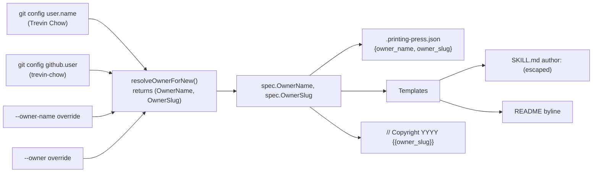
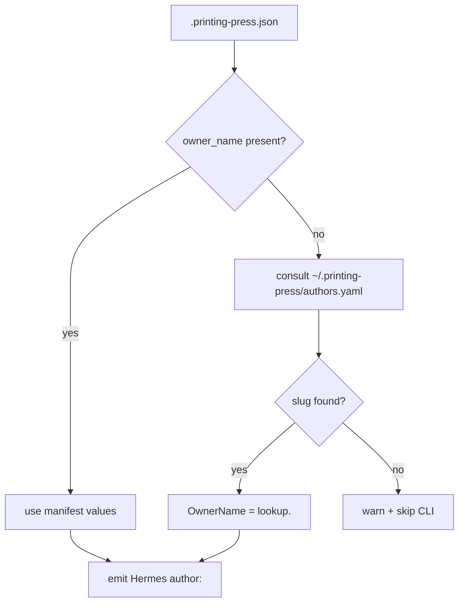
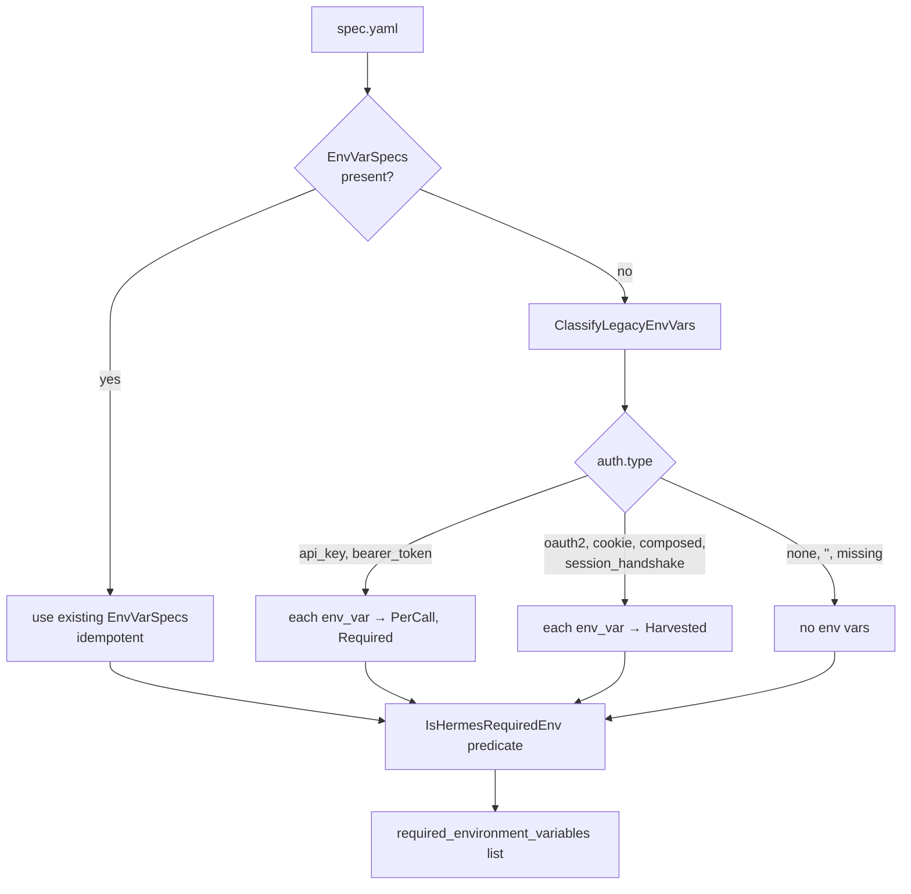
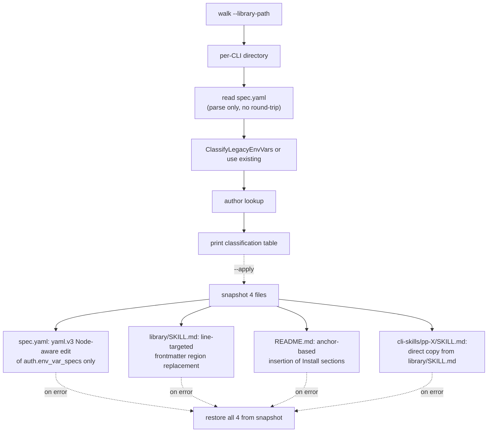
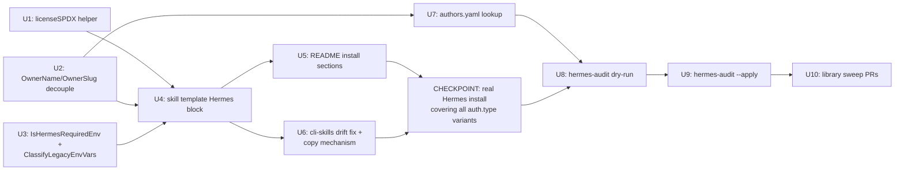

> **SUPERSEDED.** This plan was substantially scoped down after round-2 doc review surfaced architectural P0s that pushed it past the "minimum viable Hermes support" goal. The replacement at `docs/plans/2026-05-06-002-feat-hermes-openclaw-frontmatter-alignment-plan.md` drops env-var hoisting from both Hermes and OpenClaw (the source of the round-2 P0s), descopes the dual-key owner identity model, descopes the Press license migration to its own plan, descopes internal-skill parity, and reuses `tools/migrate-skill-metadata/main.go` patterns rather than building a new audit-and-apply subcommand.

# feat: Hermes agent skill compatibility for printed CLIs

## Summary

Emit Hermes-shaped YAML frontmatter alongside the existing OpenClaw block in printed-CLI SKILL.md files, add `Install via Hermes` and `Install via OpenClaw` sections to printed-CLI README templates, decouple per-CLI human-readable `owner_name` from path-safe `owner_slug` so Hermes `author:` carries a real name, fix the `cli-skills/pp-<api>/` drift across the published library so they're true copies of `library/<cat>/<api>/SKILL.md`, and ship a `printing-press hermes-audit` retrofit tool that uses an explicit `auth.type`-aware classifier (NOT the OpenAPI parser path) and line-targeted file edits (NOT yaml.Marshal round-trips) to patch `spec.yaml` + `SKILL.md` + `README.md` for the 46 already-published CLIs without clobbering hand-edits.

The Press repo's own license migration (MIT → Apache 2.0) is deferred to a separate plan — it doesn't unblock any Hermes work and carries unrelated contributor-consent requirements.

---

## Problem Frame

Hermes (`hermes-agent.nousresearch.com`) is a new agent host that consumes skills with a different YAML frontmatter shape than the Anthropic-style fields printed CLIs emit today. Hermes reads top-level `version`, `author`, `license`, `metadata.hermes.tags`, `metadata.hermes.config`, and `required_environment_variables` — with explicit `Kind`/`Required` filtering for env vars so harvested credentials never appear as user-set requirements. The current generator emits `name`, `description`, `argument-hint`, `allowed-tools`, and a nested `metadata.openclaw.*` block that Hermes doesn't recognize. Printed-CLI READMEs document install for Claude Code and Claude Desktop but not for Hermes or OpenClaw. Without these surfaces, Hermes users have no clean install path for any printed CLI, and OpenClaw users only have an informal one.

The work is asymmetric on failure: a false-positive (claiming a harvested var like `DOMINOS_TOKEN` is `required_environment_variables`) breaks the install — Hermes prompts the user for a value the CLI later overwrites. A false-negative just means a CLI fails informatively the first time it's used. Conservative classification — explicit `auth.type`-aware filter, never the legacy "back-derive everything as PerCall+Required" path — guards the asymmetric failure mode.

A second problem surfaced during planning: 40 of 46 published CLIs had drifted between `library/<cat>/<api>/SKILL.md` (the canonical content) and `cli-skills/pp-<api>/SKILL.md` (which is meant to be a copy used by `npx skills add` and Hermes install paths). The drift was traced to `tools/generate-skills/main.go`'s `injectStaleBuildFallback` function in the `printing-press-library` repo — it was appending a `GOPRIVATE='github.com/mvanhorn/*' GOFLAGS=-mod=mod` install workaround block after every `go install ...@latest` line at copy time, present only in the cli-skills mirror. **Resolved upstream by `printing-press-library#265`**, which removed `injectStaleBuildFallback` and patched all CLIs back to byte-identical copies of their library counterparts. The cli-skills-as-copy invariant now holds; this plan's job is to maintain it through the Hermes work, not to fix legacy drift.

---

## Requirements

- R1. Printed-CLI SKILL.md emits Hermes-recognized frontmatter (`name`, `description`, `version`, `author`, `license`, `metadata.hermes.tags`, `metadata.hermes.config`, `required_environment_variables`) alongside existing OpenClaw fields. Hermes ignores unknown keys; the two formats coexist in one frontmatter block.
- R2. Printed-CLI README emits two new install sections: `Install via Hermes` (CLI form `hermes skills install mvanhorn/cli-skills/pp-<api> --force` and chat form `/skills install mvanhorn/printing-press-library/cli-skills/pp-<api> --force`) and `Install via OpenClaw` (free-text instruction pointing at the GitHub URL).
- R3. `required_environment_variables` filters env vars conservatively via a new `IsHermesRequiredEnv()` predicate: `(EffectiveKind() == PerCall || EffectiveKind() == AuthFlowInput) && Required && !Sensitive`. The `!Sensitive` guard prevents OAuth `CLIENT_SECRET`-style values from appearing in the public skill metadata. `Harvested` and unrequired vars never appear. The new predicate replaces the misleading "reuse `IsRequestCredential()`" advice — `IsRequestCredential()` returns true only for `PerCall` and is unchanged.
- R4. For legacy specs without `EnvVarSpecs`, the retrofit uses an explicit auth.type-aware classifier (new function `ClassifyLegacyEnvVars` in the spec package), NOT the OpenAPI parser path. Mapping: `api_key`/`bearer_token` → user-set (PerCall, Required); `oauth2`/`cookie`/`composed`/`session_handshake` → harvested (excluded); `none` or empty → no env vars; legacy specs that already have `EnvVarSpecs` populated are left as-is. The classifier never calls `NormalizeEnvVarSpecs`'s blanket "PerCall, Required: true, Sensitive: true" back-derivation, which would mis-classify cookie auth.
- R5. Per-CLI owner identity decouples display name (`owner_name`, e.g. "Trevin Chow") from path-safe slug (`owner_slug`, e.g. "trevin-chow"). Both are captured at print time, stored in `.printing-press.json`, and survive publish. `owner_name` flows into Hermes `author:`, README author lines, and other prose surfaces. `owner_slug` continues to drive Go module paths and `// Copyright` headers (the existing regex `[A-Za-z0-9_-]+` in `RewriteOwner` does not match prose names with spaces). Per-CLI authorship varies — sometimes Trevin, sometimes others — so values come from each generation's runtime context, not a Press-level constant.
- R6. At print time, `owner_name` defaults to `git config user.name`; `owner_slug` continues to default to `git config github.user` or sanitized `user.name`. Generator flags `--owner-name` and `--owner` permit explicit override. No new user-level config file is required (no `~/.printing-press/config.yaml`, no XDG resolver, no `internal/userconfig/` package).
- R7. For legacy library CLIs whose `.printing-press.json` lacks `owner_name`, the retrofit consults a small slug-to-name lookup file (`~/.printing-press/authors.yaml`, populated once by the retrofit operator with the known contributors). When a CLI's slug is not in the lookup, the retrofit warns and skips that CLI rather than emitting `author: trevin-chow` (slug as display name) or operator-impersonation.
- R8. `cli-skills/pp-<api>/SKILL.md` is a byte-identical copy of `library/<cat>/<api>/SKILL.md`. The legacy drift (40 of 46 CLIs differing by one GOPRIVATE-block fragment) was fixed upstream in `printing-press-library#265` by removing `tools/generate-skills/main.go`'s `injectStaleBuildFallback` function. This plan's responsibility is to maintain the invariant — the retrofit's apply step (U9) must copy `library/<cat>/<api>/SKILL.md` to `cli-skills/pp-<api>/SKILL.md` after patching, and `hermes-audit` must report any future drift as a finding.
- R9. `printing-press hermes-audit` walks the public library at the path provided by `--library-path` (with `PRINTING_PRESS_LIBRARY_PATH` env-var override and a sensible default; not a hardcoded `~/Code/...` operator path) and reports a per-CLI classification table covering all `auth.type` values present (including empty/missing). Read-only by default.
- R10. `printing-press hermes-audit --apply` performs line-targeted text edits — never full template re-renders. The frontmatter region in each `SKILL.md` is replaced surgically; the `Install via Hermes`/`Install via OpenClaw` sections are inserted into each `README.md` at a defined anchor; `spec.yaml` is updated by editing only the `auth.env_var_specs` block (yaml.v3 Node-aware) without round-tripping the whole document and clobbering comments. `cli-skills/pp-<api>/SKILL.md` is rewritten via direct copy from the patched per-CLI SKILL.md. Snapshot-restore safety per the validation-must-not-mutate convention. Idempotent — second run produces zero diff.
- R11. Before the library retrofit sweep mutates anything (R10 apply step), generate sample outputs for **at least one CLI per distinct `auth.type` value** present in the live library (api_key, bearer_token, cookie, composed, oauth2, session_handshake, none, empty). Surface to the user. The user must perform a real Hermes install of at least one sample (`hermes skills install ...`) to verify the loader actually accepts the frontmatter — not just that the YAML is shape-correct against the documented schema. Sweep does not proceed until that verification confirms acceptance.

---

## Scope Boundaries

- Reprinting binaries during the library retrofit. The sweep patches metadata only (`spec.yaml`, `SKILL.md`, `cli-skills/pp-<api>/SKILL.md`, `README.md`); the published binaries are untouched. Spec-vs-binary metadata drift is bounded by sourcing the Hermes `version:` field from `.printing-press.json`'s `printing_press_version` (the version that produced this CLI), NOT from the current Press version — this prevents version churn invalidating Hermes skill caches on every Press release.
- Hermes optional fields beyond the chosen subset: `platforms`, `metadata.hermes.related_skills`, `metadata.hermes.requires_toolsets`, `metadata.hermes.requires_tools`, `metadata.hermes.fallback_for_toolsets`, `metadata.hermes.fallback_for_tools`, `required_credential_files`. These don't fit the printed-CLI shape today; reconsider when there's a real use case.
- LLM-generated `required_for` text per CLI. Static per-Kind value (`"API access"` for `PerCall`, `"Initial auth setup"` for `AuthFlowInput`) is sufficient for the conservative-filter case where almost always one entry emits.
- Reshaping existing Anthropic-style frontmatter conventions (`allowed-tools`, `argument-hint`, `context: fork`, `min-binary-version`). These continue to work in the OpenClaw-block coexistence model.
- Tool permission/safety annotation changes (`mcp:read-only`, `mcp:hidden`, etc.). Out of scope for this plan.
- The catalog's MCPB `manifest.json` (`library/<cat>/<api>/manifest.json`). It already declares `license: Apache-2.0` and `author.name: "CLI Printing Press"`. Leave alone unless a separate authorship-policy decision changes it.
- Internal Press skills (`skills/printing-press*/SKILL.md`) Hermes parity. Descoped — these skills wrap the printing-press binary for development of the Press itself; they're not candidates for the Hermes registry, and adding Hermes frontmatter to them does not advance the goal of "Hermes users can install printed CLIs." If a real Hermes consumer surfaces for Press authoring skills, file as follow-up.

### Deferred to Follow-Up Work

- **Press repo MIT → Apache 2.0 license migration**: descoped from this plan. The motivation in the prior draft was "so Hermes frontmatter can declare `license: Apache-2.0` consistently," but printed CLIs already declare Apache 2.0 via `LICENSE.tmpl` and Hermes `license:` describes the printed CLI's license, not the Press's. A `licenseSPDX` template helper sourcing `"Apache-2.0"` from a single canonical value is sufficient for Hermes work without changing the Press's own license. The migration carries real contributor-consent requirements (LICENSE attributes Matt Van Horn and Trevin Chow; `git log` shows additional contributors Cathryn Lavery and Dinakar Sarbada whose consent must be explicitly obtained) and deserves its own plan with a clean justification on the merits (patent grant, Apache-ecosystem alignment).
- **Phase 2 auth-enrichment `auth.key_url` backfill**: ~27% of legacy specs have `key_url` populated. Improving coverage to ~90% would lift Hermes `help` field quality across the board, plus README "Setup" sections and doctor messages. Tracked as a separate plan after this work lands.
- **Catalog enrichment for legacy specs with `Category=""`**: ~80% of library specs lack a catalog entry and fall back to `category: other`. The Hermes sweep emits `metadata.hermes.tags: [other]` for these. A separate effort to backfill catalog entries would lift tag quality.
- **Capturing this work as a `/ce-compound` learning**: library-wide cli-skills realignment + Hermes coexistence + auth-classifier retrofit is exactly the cross-cutting precedent future Press changes will want.

---

## Context & Research

### Relevant Code and Patterns

- **Skill template (existing frontmatter emission point)**: `internal/generator/templates/skill.md.tmpl` — currently emits `metadata.openclaw.*` nested block; adding Hermes parity extends this same file. Tests at `internal/generator/skill_test.go` (`TestSkillFrontmatterMetadataIsClawHubCompliantNestedYAML`, `TestSkillFrontmatterEnvVarsOmitsHarvestedAuthEnvVars`) already assert frontmatter shape.
- **README template**: `internal/generator/templates/readme.md.tmpl` — `Use with Claude Code` section near line 297 is the existing install-section pattern. New `Install via Hermes`/`Install via OpenClaw` sections slot alongside.
- **Auth env-var rich model**: `internal/spec/spec.go` (`AuthEnvVar` at L467, `AuthEnvVarKind` at L476-482, `IsRequestCredential()` at L493 — returns true only for `PerCall`, NOT `AuthFlowInput`). New predicate `IsHermesRequiredEnv()` lives alongside.
- **Conservative classifier (new)**: `ClassifyLegacyEnvVars(authConfig) []AuthEnvVar` lives in `internal/spec/` (or a new `internal/spec/hermes/` subpackage). Reads `auth.type` and `auth.env_vars` (legacy flat list); returns explicit `[]AuthEnvVar` with correct `Kind`. Replaces the misleading "reuse parser idempotency" approach.
- **Owner resolution chain**: `internal/generator/plan_generate.go:289-369` (`resolveOwnerForExisting`, `resolveOwnerForNew`, `sanitizeOwner`, `parseCopyrightOwner`). Decouple here — `resolveOwnerForNew` returns both `OwnerName` and `OwnerSlug` from `git config user.name` + `git config github.user`/`sanitizeOwner(user.name)`.
- **Generator owner re-sanitization**: `internal/generator/generator.go:158-169` — `New()` re-applies sanitizer to slug only after decouple. `OwnerName` passes through unchanged but is YAML-escaped via `yamlDoubleQuoted` at template emission.
- **Owner rewrite**: `internal/pipeline/owner_rewrite.go` (`RewriteOwner`, `RewriteModulePath`) — regex anchored on `[A-Za-z0-9_-]+`. Stays slug-only, no widening needed.
- **Manifest field**: `internal/pipeline/climanifest.go:378` (`CLIManifest.Owner`) — extend to `OwnerName` and `OwnerSlug`. Backwards-compat: legacy `.printing-press.json` files with only `owner` map to `OwnerSlug`; `OwnerName` is filled via authors lookup at retrofit time.
- **Authors lookup (new)**: `~/.printing-press/authors.yaml` — small file mapping `slug → display_name`, populated by the retrofit operator. Used by retrofit only, not at fresh-print time. Lookup helper lives in `internal/cli/hermes_audit.go` (or a small shared package).
- **Migration tool precedent (line-targeted edits)**: `tools/migrate-skill-metadata/main.go:23-25` explicitly states "this tool does no yaml.v3 round-trip of the full frontmatter, only line-targeted text replacement of the metadata region." This is the precedent the retrofit follows — NOT full template re-rendering, NOT yaml.Marshal round-trips.
- **Audit subcommand precedent**: `internal/cli/mcp_audit.go` + `internal/cli/mcp_audit_test.go` — closest pattern for `hermes-audit` (walk library, JSON or table output, never exits non-zero in dry-run mode). Default path uses `PressHome()` + override env var, NOT a hardcoded `~/Code/...` path.
- **Apply-with-rollback precedent**: `internal/pipeline/regenmerge/apply.go` — tempdir + atomic moves. The hermes-audit `--apply` follows this with snapshot-restore for non-git directories per the validation-must-not-mutate solution.
- **Catalog**: `internal/catalog/catalog.go:19-38` — 17 valid categories + `other`, kebab-cased, tag-suitable as-is.
- **Golden harness**: `scripts/golden.sh` (lines 124-128) already passes `GIT_CONFIG_KEY_0=github.user` AND `GIT_CONFIG_KEY_1=user.name`, both set to the same `$golden_owner` value. The change for owner-decouple is to differentiate the values (e.g., `VALUE_0=printing-press-golden`, `VALUE_1=Printing Press Golden`) so priority-inversion bugs surface in tests.
- **Library structure**: `~/Code/printing-press-library/library/<category>/<api>/` (per-CLI rich tree) and `~/Code/printing-press-library/cli-skills/pp-<api>/SKILL.md` (used by `npx skills add` and Hermes install). 46 entries on each side, alignment confirmed pairwise.
- **README scoring (verified)**: `internal/pipeline/scorecard.go:478` — `scoreREADME` only checks for Quick Start / Agent Usage / Doctor / Health Check / Troubleshooting / Cookbook / Recipes section names. Adding `Install via Hermes` and `Install via OpenClaw` does not affect Tier 1 scoring.

### Institutional Learnings

- **`docs/solutions/design-patterns/auth-envvar-rich-model-2026-05-05.md`** — direct precedent for the auth-model surface set this work touches. SKILL frontmatter is named as one of the surfaces that drifted when downstream consumers re-derived semantics; the new `IsHermesRequiredEnv()` predicate is the deterministic selector that prevents future drift.
- **`docs/solutions/logic-errors/mcp-handler-conflates-path-and-query-positional-params-2026-05-05.md`** — closest precedent for the multi-CLI backport pattern. The Movie Goat / Shopify / Linear / Archive.is / Weather Goat / Cal.com sweep via `printing-press-library#232` and `#233` is the precedent for organizing the Hermes retrofit. Calls out the recurrence pattern where a fix lands in one template but doesn't propagate to a sibling — applies to skill template + cli-skills alignment.
- **`docs/solutions/best-practices/checkout-scoped-printing-press-output-layout-2026-03-28.md`** — the both-keys-present test pattern (`TestManuscriptLookupPriority`) applies to the new `owner_name`/`owner_slug` dual-key shape. Test with both populated, divergent, and one-only fixtures so a priority inversion can't silently invert.
- **`docs/solutions/best-practices/validation-must-not-mutate-source-directory-2026-03-29.md`** — the snapshot-compare-restore pattern is the safety guardrail for `hermes-audit --apply` over `~/Code/printing-press-library/library/<api>/` directories that may not be git repos.
- **`tools/migrate-skill-metadata/main.go`** (precedent, not solutions doc) — the line-targeted edit pattern with idempotency tests. The retrofit follows this shape exactly.

### External References

- Hermes frontmatter docs: `https://hermes-agent.nousresearch.com/docs/developer-guide/creating-skills` — required fields (`name`, `description`, `version`, `author`, `license`), optional `platforms`/`metadata.hermes.*`/`required_environment_variables`/`required_credential_files`, with sub-schemas for `config` (key/description/default/prompt) and `required_environment_variables` (name/prompt/help/required_for).

---

## Key Technical Decisions

- **Hermes frontmatter coexists with OpenClaw block.** Hermes ignores unknown keys per its docs; one SKILL.md serves both hosts. The maintenance debt of multi-host coexistence is a real but accepted tradeoff — the alternative (host-specific SKILL.md emission) is significantly more template surface for unclear future-host benefit.
- **New `IsHermesRequiredEnv()` predicate; `IsRequestCredential()` unchanged.** The prior plan's "reuse `IsRequestCredential()`" instruction was wrong — `IsRequestCredential()` returns true only for `PerCall`. The new predicate is `(EffectiveKind() == PerCall || EffectiveKind() == AuthFlowInput) && Required && !Sensitive`, with the `!Sensitive` guard preventing OAuth `CLIENT_SECRET`-style values from leaking into public skill metadata.
- **Explicit `ClassifyLegacyEnvVars()` for the retrofit, not OpenAPI parser reuse.** The prior plan claimed the parser path was idempotent and reusable; in fact only ~11/46 library specs are OpenAPI documents, and the cookie→harvested classification only lives in the OpenAPI parser branch. The retrofit needs its own classifier built specifically for the auth.type-aware mapping.
- **Line-targeted edits, not full template re-renders.** The retrofit follows the `tools/migrate-skill-metadata/main.go` precedent exactly: surgical text replacement of the frontmatter region, anchor-based insertion of new README sections, yaml.v3 Node-aware editing of the `auth.env_var_specs` block in `spec.yaml`. Full re-renders would clobber post-publish hand-edits, narrative copy, retro-driven fixes, comments, and intentional ordering.
- **`cli-skills/pp-<api>/SKILL.md` is a copy, not a separate template.** The prior plan's U8 was built on a false premise — there is no `skill_focused.md.tmpl`. The publish path's `tools/generate-skills/main.go` (in the `printing-press-library` repo) does the copy. The legacy GOPRIVATE-block drift was fixed in `printing-press-library#265`; this plan's retrofit must preserve the invariant by copying from library to cli-skills as the final step of each per-CLI apply.
- **Per-CLI owner identity, captured at print time.** Owner identity (both `OwnerName` and `OwnerSlug`) is captured at fresh-print time and stored in `.printing-press.json`. Each printed CLI carries its own author. The retrofit never consults the operator's git config — it reads from each CLI's `.printing-press.json` (legacy slug-only) plus the authors-lookup file for legacy specs. This matches "sometimes it's me, sometimes it's others."
- **No new user-level config package.** The prior plan introduced `internal/userconfig/`, `~/.printing-press/config.yaml`, and an XDG resolver — over-engineered for one prose field. Reading `git config user.name` at print time and accepting `--owner-name` flag override is sufficient. The retrofit's authors-lookup file (`~/.printing-press/authors.yaml`) is a small, scoped file used only by the retrofit, not a general user config.
- **Library publish path is hardcoded `mvanhorn/printing-press-library` in templates.** Don't introduce an abstraction layer for a value that's currently a single constant.
- **Hermes-audit `--library-path` defaults to PressHome-relative path with env-var override.** Matches `mcp-audit` precedent at `internal/cli/mcp_audit.go:44`. Default: `~/printing-press/library` (or `$PRINTING_PRESS_LIBRARY_PATH` if set). NOT a hardcoded `~/Code/...` operator path.
- **Hermes `version:` field sources from `.printing-press.json`'s `printing_press_version` (the version that produced the CLI), not the current Press version.** Prevents version churn invalidating Hermes skill caches on every Press release. New prints use the current Press version (which becomes the recorded `printing_press_version`); retrofit reads the recorded value.
- **`metadata.hermes.config` content is one entry**: `<api-slug>.cache_dir` pointing at the existing CLI cache path. Anything more is YAGNI.
- **`metadata.hermes.tags` sources from catalog `category`** (single-element array) when present; falls back to `[other]` otherwise.
- **`required_for` is static per-Kind**: `"API access"` for `PerCall`, `"Initial auth setup"` for `AuthFlowInput`.
- **`prompt` uses `AuthEnvVar.Description` directly when present.** Synthesized fallback `"Enter your <DisplayName> <noun>"` only when description is empty.
- **`help` field omitted entirely when `auth.key_url` is empty.** A wrong/generic help string is worse than no help string.
- **`owner_name` is YAML-escaped at template emission.** A `git config user.name` value containing colons or quotes would otherwise corrupt the frontmatter. Apply `yamlDoubleQuoted` (already registered as a template helper) to `OwnerName` everywhere it lands in YAML output.

---

## Open Questions

### Resolved During Planning

- **Skill emission targets for Hermes frontmatter**: per-CLI library tree (`library/<cat>/<api>/SKILL.md`) is authoritative; cli-skills entries are publish-time copies. No separate cli-skills emission path.
- **Library retrofit covers spec.yaml + per-CLI SKILL.md + README + cli-skills (via copy)**: yes, all four per CLI.
- **CHECKPOINT timing and scope**: after generator emission lands; samples cover all `auth.type` variants present in the live library; user must perform a real Hermes install of at least one sample before the sweep starts. This is the CHECKPOINT, not a separate "human review of YAML" step.
- **Press → Apache 2.0 migration**: deferred to its own plan. Not required for Hermes work since printed CLIs are already Apache 2.0.
- **Hermes `version:` field**: pinned to `.printing-press.json`'s `printing_press_version` (the binary's actual version), not the current Press version. Resolved during plan revision.
- **R3 / `IsRequestCredential()` contradiction**: resolved by introducing `IsHermesRequiredEnv()` as a new predicate. The legacy `IsRequestCredential()` stays unchanged.
- **Empty/missing `auth.type` case**: classified as no env vars (same as `none`).
- **Owner identity during retrofit**: read from `.printing-press.json`'s `owner_slug` + lookup in `~/.printing-press/authors.yaml`. Operator's git config is NOT consulted during retrofit.

### Deferred to Implementation

- **Where exactly to put `IsHermesRequiredEnv()` and `ClassifyLegacyEnvVars()`**: probably methods on `AuthEnvVar` and `AuthConfig` respectively in `internal/spec/spec.go`, alongside the existing predicates. Decide during U3.
- **Whether the cli-skills-as-copy mechanism is enforced at publish time or at hermes-audit time**: both are reasonable. Decide during U7.
- **The exact YAML editing library for `spec.yaml` line-targeted edits**: yaml.v3's Node API supports comment-preserving edits; alternatives include line-range string replacement (matching migrate-skill-metadata exactly). Decide during U10 based on what works.

---

## High-Level Technical Design

> *This illustrates the intended approach and is directional guidance for review, not implementation specification. The implementing agent should treat it as context, not code to reproduce.*

### Per-CLI owner identity, captured at print time



### Retrofit author resolution (legacy CLIs)



### Auth-type-aware classification (replaces parser-idempotency approach)



### Hermes audit + apply data flow (line-targeted edits)



### Implementation sequencing



---

## Implementation Units

### U1. Add `licenseSPDX` template helper

**Goal:** Single canonical source for `"Apache-2.0"` so subsequent units don't hardcode the string in templates.

**Requirements:** R1

**Dependencies:** None

**Files:**
- Modify: `internal/generator/generator.go` (register helper)
- Test: `internal/generator/generator_test.go`

**Approach:**
- Register `licenseSPDX` returning `"Apache-2.0"` alongside existing `currentYear`, `modulePath` helpers at `internal/generator/generator.go:240`.
- One-line helper. No template changes yet — U4 picks it up.

**Test scenarios:**
- Happy path: helper returns `"Apache-2.0"` exactly.

**Verification:**
- `go test ./internal/generator/...` passes.

---

### U2. Decouple `OwnerName` from `OwnerSlug`

**Goal:** Replace the conflated `Owner` field with `OwnerName` (prose) and `OwnerSlug` (path-safe) throughout spec, manifest, generator, and templates. Both captured at print time from git config (or override flags) and stored in `.printing-press.json`.

**Requirements:** R5, R6

**Dependencies:** None

**Files:**
- Modify: `internal/spec/spec.go` (add `OwnerName` field; map legacy `Owner` to `OwnerSlug`)
- Modify: `internal/generator/plan_generate.go` (`resolveOwnerForExisting`, `resolveOwnerForNew` return both values)
- Modify: `internal/generator/generator.go` (`New()` re-sanitizes only `OwnerSlug`; `OwnerName` passes through unchanged but is YAML-escaped at emission)
- Modify: `internal/pipeline/climanifest.go` (`CLIManifest.OwnerName`, `CLIManifest.OwnerSlug`; `WriteManifestForGenerate` populates both)
- Modify: `internal/cli/root.go` (add `--owner-name` flag alongside existing `--owner`)
- Modify: `scripts/golden.sh` lines 124-128 (differentiate `VALUE_0` and `VALUE_1` to surface priority-inversion bugs)
- Test: `internal/generator/plan_generate_test.go`, `internal/spec/spec_test.go`, `internal/pipeline/climanifest_test.go`

**Approach:**
- Backwards-compat: existing `Owner` field on the spec maps to `OwnerSlug`; legacy `.printing-press.json` files with only `owner` map to `OwnerSlug`. `OwnerName` falls back to empty in legacy reads — the retrofit's authors-lookup (U7) covers that case.
- New precedence chain for `OwnerName`: `--owner-name` flag > `git config user.name` > empty.
- New precedence chain for `OwnerSlug`: `--owner` flag > `.printing-press.json` `owner` (legacy) or `owner_slug` > parsed copyright header > `git config github.user` > sanitized `git config user.name` > literal `"USER"`.
- `internal/generator/generator.go:158-169` re-sanitizes `OwnerSlug` only. `OwnerName` passes through verbatim (YAML escape happens at template-emit time, not in `New()`).
- All template touchpoints that currently use `{{.Owner}}` for prose surfaces (README author lines, etc.) get updated to `{{yamlDoubleQuoted .OwnerName}}` or `{{.OwnerName}}` as appropriate. Copyright headers continue to use slug.

**Patterns to follow:**
- Existing `resolveOwnerFor*` chain in `internal/generator/plan_generate.go:289-369`.
- Both-keys-present test pattern from `docs/solutions/best-practices/checkout-scoped-printing-press-output-layout-2026-03-28.md`.
- `parseCopyrightOwner` regex stays unchanged (still matches slug-shaped strings only).

**Test scenarios:**
- Happy path: spec with both `OwnerName` and `OwnerSlug` set flows both through generator and manifest.
- Happy path: spec with only legacy `Owner` field maps to `OwnerSlug`; `OwnerName` is populated from `git config user.name` precedence chain.
- Edge case: `OwnerName` containing spaces ("Trevin Chow") survives `New()` re-sanitization unchanged.
- Edge case: `OwnerSlug` containing spaces is sanitized to "trevin-chow"; `OwnerName` remains unchanged.
- Edge case: missing `git config user.name` → `OwnerName` is empty; downstream Hermes emission either falls back or errors clearly (resolved in U4).
- Edge case: `OwnerName` containing YAML special characters (e.g., `Foo: Bar`, `"Quote"`) is correctly escaped when emitted via `yamlDoubleQuoted`.
- Integration: full generate path with both fields populated produces correct copyright header (slug only) and writes both fields to `.printing-press.json`.
- Integration: regen-merge with diverging fields preserves both correctly.
- Integration (golden harness): with `VALUE_0=printing-press-golden` and `VALUE_1=Printing Press Golden` (differentiated), the rendered SKILL.md and README correctly use the slug for paths and the prose name for author surfaces.

**Verification:**
- All `internal/generator` and `internal/pipeline` tests pass.
- A test with `OwnerName: "Trevin Chow"` and `OwnerSlug: "trevin-chow"` produces a copyright header reading `// Copyright 2026 trevin-chow.` (slug only).
- Golden fixtures regenerated and reviewed.

---

### U3. Add `IsHermesRequiredEnv()` predicate and `ClassifyLegacyEnvVars()` classifier

**Goal:** Introduce the conservative env-var filter for Hermes emission and the explicit auth.type-aware classifier for the retrofit. Both live alongside the existing predicates in `internal/spec/spec.go`.

**Requirements:** R3, R4

**Dependencies:** None (independent of U1, U2)

**Files:**
- Modify: `internal/spec/spec.go` (add `IsHermesRequiredEnv` method on `AuthEnvVar`; add `ClassifyLegacyEnvVars` function on `AuthConfig` or a top-level helper)
- Test: `internal/spec/spec_test.go`

**Approach:**
- `IsHermesRequiredEnv()` on `AuthEnvVar`:
  ```
  func (v AuthEnvVar) IsHermesRequiredEnv() bool {
      kind := v.EffectiveKind()
      return (kind == AuthEnvVarKindPerCall || kind == AuthEnvVarKindAuthFlowInput) &&
             v.Required && !v.Sensitive
  }
  ```
- `ClassifyLegacyEnvVars(c AuthConfig) []AuthEnvVar`:
  - If `c.EnvVarSpecs` is non-empty, return as-is (idempotent).
  - Otherwise, derive from `c.Type` + `c.EnvVars`:
    - `api_key` or `bearer_token` → each var as `Kind: PerCall, Required: true, Sensitive: true, Inferred: true`.
    - `oauth2`, `cookie`, `composed`, `session_handshake` → each var as `Kind: Harvested, Required: false, Sensitive: true, Inferred: true`.
    - `none`, `""` (empty), unknown → return empty.
- Critical: this classifier is the single source of truth for retrofit classification. It does NOT call `NormalizeEnvVarSpecs` (which is the existing back-derivation that mis-classifies cookies as `PerCall+Required`). It does NOT depend on the OpenAPI parser.

**Patterns to follow:**
- Existing predicate methods on `AuthEnvVar` at `internal/spec/spec.go:485-507`.
- The auth-envvar-rich-model design pattern's "additive widening" — these are new functions, no existing semantics change.

**Test scenarios:**
- Happy path: `IsHermesRequiredEnv()` returns true for `Kind: PerCall, Required: true, Sensitive: false`.
- Happy path: returns true for `Kind: AuthFlowInput, Required: true, Sensitive: false`.
- Edge case: returns false for `Kind: PerCall, Required: false` (any sensitivity).
- Edge case: returns false for `Kind: PerCall, Required: true, Sensitive: true` (sensitive guard).
- Edge case: returns false for `Kind: Harvested` (any combination).
- Edge case: returns false for `Kind: AuthFlowInput, Required: true, Sensitive: true` (sensitive guard prevents CLIENT_SECRET emission).
- Happy path: `ClassifyLegacyEnvVars` for `auth.type: api_key, env_vars: [SHOPIFY_ACCESS_TOKEN]` returns `[{Name: "SHOPIFY_ACCESS_TOKEN", Kind: PerCall, Required: true, Sensitive: true, Inferred: true}]`.
- Happy path: for `auth.type: cookie, env_vars: [ALLRECIPES_COOKIES]` returns `[{Name: "ALLRECIPES_COOKIES", Kind: Harvested, Required: false, Sensitive: true, Inferred: true}]`.
- Happy path: for `auth.type: oauth2, env_vars: [GOOGLE_PHOTOS_TOKEN]` returns `[{Kind: Harvested, ...}]`.
- Happy path: for `auth.type: composed, env_vars: [...]` returns all-harvested.
- Edge case: for `auth.type: none` returns empty.
- Edge case: for `auth.type: ""` (empty string) returns empty.
- Edge case: for `auth.type: bearer_token, env_vars: [DOMINOS_TOKEN]` returns `[{Kind: PerCall, Required: true}]` — note this is BEFORE `EnvVarSpecs` is populated; in practice Dominos already has `EnvVarSpecs` so the function returns the existing values and never hits this branch.
- Edge case: spec with `EnvVarSpecs` populated (Dominos-shape) — returns the existing specs unchanged, ignoring `EnvVars` legacy list.
- Integration: combined — `ClassifyLegacyEnvVars(shopify.Auth)` filtered through `IsHermesRequiredEnv()` returns `[SHOPIFY_ACCESS_TOKEN]`.
- Integration: combined — `ClassifyLegacyEnvVars(allrecipes.Auth)` filtered through `IsHermesRequiredEnv()` returns `[]`.

**Verification:**
- All tests pass with explicit fixtures for every `auth.type` value present in the live library.

---

### U4. Hermes frontmatter emission in printed-CLI skill template

**Goal:** Extend `internal/generator/templates/skill.md.tmpl` to emit Hermes-recognized fields alongside the existing OpenClaw block.

**Requirements:** R1, R3

**Dependencies:** U1 (licenseSPDX helper), U2 (OwnerName), U3 (IsHermesRequiredEnv predicate)

**Files:**
- Modify: `internal/generator/templates/skill.md.tmpl`
- Test: `internal/generator/skill_test.go` (extend or new `skill_hermes_test.go`)

**Approach:**
- Add a `metadata.hermes.*` nested block alongside the existing `metadata.openclaw.*`. Both nest under `metadata`.
- `version`: sourced from `.printing-press.json`'s `printing_press_version` (the version that produced this CLI), exposed as `{{.PressVersion}}` — register the helper or expose as field in U1's helper-registration step. Pinned to print-time version, NOT the live Press version, to avoid Hermes cache invalidation on every Press release.
- `author`: `{{yamlDoubleQuoted .OwnerName}}`. If `OwnerName` is empty, hard error during generation rather than emit empty.
- `license`: `{{licenseSPDX}}` → `"Apache-2.0"`.
- `metadata.hermes.tags`: `[{{.Category | default "other"}}]` — single-element array.
- `metadata.hermes.config`: one entry — `<api>.cache_dir` pointing at the existing CLI cache path.
- `required_environment_variables`: filter via `IsHermesRequiredEnv()`; emit `name`, `prompt`, `help`, `required_for` per entry. Omit the field entirely when no entries qualify.

**Execution note:** Test-first. Existing `TestSkillFrontmatterEnvVarsOmitsHarvestedAuthEnvVars` already locks down the conservative-filter behavior for the OpenClaw block; mirror its shape for new Hermes-block tests before editing the template.

**Patterns to follow:**
- Existing `metadata.openclaw.*` block in `skill.md.tmpl:8-44`.
- `IsHermesRequiredEnv()` predicate from U3.

**Test scenarios:**
- Happy path (Shopify-shape, api_key + 1 required PerCall env var): emits Hermes block with one `required_environment_variables` entry, `help` populated from `key_url`.
- Happy path (no auth, type=none): emits Hermes block, no `required_environment_variables` field.
- Edge case (Dominos-shape, all-harvested + auth_flow_input optional): emits Hermes block with no `required_environment_variables` field.
- Edge case (mixed: one `PerCall+Required+!Sensitive`, one `Harvested`): emits one entry only.
- Edge case (`auth.type: cookie`, `EnvVarSpecs` from `ClassifyLegacyEnvVars` shows all harvested): no `required_environment_variables`.
- Edge case (`auth.type: bearer_token` with Sensitive+Required PerCall var): excluded from emission per `!Sensitive` guard.
- Edge case (`AuthEnvVar.Description` populated): `prompt` uses it directly.
- Edge case (`AuthEnvVar.Description` empty): `prompt` synthesized from `DisplayName` + auth-type noun.
- Edge case (`AuthConfig.KeyURL` empty): `help` field omitted entirely.
- Edge case (`OwnerName` containing YAML special characters): correctly escaped via `yamlDoubleQuoted`.
- Error path: `OwnerName` is empty → generator returns clear error before writing SKILL.md.
- Integration: rendered frontmatter parses as valid YAML via `gopkg.in/yaml.v3`.

**Verification:**
- All `internal/generator/skill_test.go` tests pass.
- `scripts/golden.sh verify` passes after intentional updates to the four `generate-golden-*` cases.

---

### U5. Hermes Install + OpenClaw Install sections in README template

**Goal:** Add `Install via Hermes` and `Install via OpenClaw` sections to `internal/generator/templates/readme.md.tmpl`, slotting alongside existing `Use with Claude Code` and `Use with Claude Desktop`.

**Requirements:** R2

**Dependencies:** U2 (OwnerName for byline if updated), U4 in parallel

**Files:**
- Modify: `internal/generator/templates/readme.md.tmpl`
- Test: `internal/generator/readme_test.go` (or new `readme_hermes_test.go`)

**Approach:**
- Add two new sections, in the order: `Use with Claude Code` → `Use with Claude Desktop` → `Install via Hermes` → `Install via OpenClaw`. Hardcode `mvanhorn/printing-press-library` and `mvanhorn/cli-skills` directly.
- Place an HTML comment anchor (e.g., `<!-- pp-hermes-install-anchor -->`) immediately before the new sections. The retrofit (U9) uses this anchor for idempotent insertion.
- Hermes section emits both forms verbatim; OpenClaw section emits the user-confirmed wording.
- README scoring: verified at `internal/pipeline/scorecard.go:478` that `scoreREADME` does not key on these section names — no scorer update needed.

**Patterns to follow:**
- Existing `Use with Claude Code` section at `readme.md.tmpl:297-358`.

**Test scenarios:**
- Happy path: rendered README contains `## Install via Hermes` heading.
- Happy path: rendered README contains both Hermes install command forms with `pp-<api>` substituted correctly.
- Happy path: rendered README contains the OpenClaw section with the GitHub URL substituted correctly.
- Happy path: rendered README contains the anchor comment for retrofit-time insertion.
- Edge case: install URLs always say `mvanhorn/...`, never the owner. Catches accidentally templating the publisher.
- Integration: golden fixtures update for all four `generate-golden-*` cases.

**Verification:**
- `internal/generator/readme_test.go` passes.
- `scripts/golden.sh verify` passes after intentional updates.

---

### U6. Document and verify the cli-skills-as-copy invariant

**Goal:** Document the cli-skills-as-copy convention so future contributors don't reintroduce drift, and add an audit check so any future divergence is detected.

**Requirements:** R8

**Dependencies:** None — the legacy drift is already fixed (PR #265 removed `injectStaleBuildFallback` from `tools/generate-skills/main.go` and patched all 46 CLIs back to byte-identical with their library counterparts).

**Files:**
- Cross-repo: `printing-press-library/AGENTS.md` (document the invariant — `cli-skills/pp-<api>/SKILL.md` is a byte-identical copy of `library/<cat>/<api>/SKILL.md`; do not hand-edit the cli-skills entries)
- This repo: `internal/cli/hermes_audit.go` (the audit reports any drift as a finding; the `--apply` step's final per-CLI step copies library SKILL.md to cli-skills)

**Approach:**
- No file mutation needed in this unit — the drift is already fixed via PR #265.
- Add a brief section to `printing-press-library/AGENTS.md` stating the invariant and pointing at `tools/generate-skills/main.go` as the source of cli-skills generation.
- The hermes-audit subcommand (U8) reports cli-skills drift as a finding column; under normal operation, the column should always read "no drift" after this plan ships.
- The `--apply` step (U9) preserves the invariant by copying patched library SKILL.md to cli-skills as the final per-CLI step.

**Patterns to follow:**
- PR #265 is the precedent for fixing systematic drift at the source generator, not in each printed CLI.

**Test scenarios:**
- Test expectation: none for code in this repo. Documentation is verified by inspection.
- Audit-side verification: a fixture library tree with intentional drift in one CLI's cli-skills entry causes `hermes-audit` to report that drift.

**Verification:**
- `printing-press-library/AGENTS.md` documents the invariant.
- After the U9 sweep, `diff -r library/<cat>/<api>/SKILL.md cli-skills/pp-<api>/SKILL.md` is empty for every CLI.

---

### U7. Authors lookup file (`~/.printing-press/authors.yaml`)

**Goal:** Provide a small slug-to-display-name lookup file for the retrofit, so legacy `.printing-press.json` files (which only have `owner` slug) can resolve `OwnerName` for the Hermes `author:` field.

**Requirements:** R7

**Dependencies:** U2 (OwnerName/OwnerSlug decouple)

**Files:**
- Create: `internal/cli/authors_lookup.go` (loader; can live in the hermes_audit package)
- Create: `internal/cli/authors_lookup_test.go`
- Document: a sample `authors.yaml` in `docs/HERMES.md` or inline in the hermes-audit `--help` output

**Approach:**
- File format:
  ```yaml
  trevin-chow: Trevin Chow
  matt-van-horn: Matt Van Horn
  cathryn-lavery: Cathryn Lavery
  dinakar-sarbada: Dinakar Sarbada
  ```
- `LoadAuthors() (map[string]string, error)` reads `~/.printing-press/authors.yaml` (or `$PRINTING_PRESS_AUTHORS` env override). Returns empty map (no error) when file is absent — first-run convenience.
- Used only by hermes-audit. New prints capture `OwnerName` directly from git config and don't need the lookup.
- No XDG resolver, no userconfig package. Single file, single function.

**Patterns to follow:**
- Lightweight YAML loader, similar to `internal/catalog/catalog.go` shape but simpler.

**Test scenarios:**
- Happy path: load with one entry returns the expected map.
- Edge case: missing file returns empty map and no error.
- Edge case: malformed YAML returns clear error.
- Edge case: `$PRINTING_PRESS_AUTHORS` env var override resolves a different path.

**Verification:**
- All tests pass.

---

### CHECKPOINT: real Hermes loader verification

**Goal:** Before any retrofit `--apply` runs, generate sample outputs covering all `auth.type` variants present in the live library, and verify Hermes actually loads at least one of them via real install (not just shape-correctness against the documented schema).

**Requirements:** R11

**Dependencies:** U4, U5, U6 all merged

**Files:**
- None (this is a process gate)

**Approach:**
- For each distinct `auth.type` value present in the live library (verified set: `api_key`, `bearer_token`, `oauth2`, `cookie`, `composed`, `none`, empty/missing — `session_handshake` may or may not be present, include if so), pick one representative CLI:
  - `api_key`: Shopify
  - `bearer_token`: Dominos (already has `EnvVarSpecs`)
  - `oauth2`: Google Photos
  - `cookie`: eBay or Allrecipes
  - `composed`: Pagliacci
  - `none`: Wikipedia
  - empty/missing: TikTok-Shop (or whichever is in the live library)
- Run `printing-press generate` (or the equivalent local-only render) for each, producing a sample `SKILL.md` and `README.md`.
- Surface to the user: the full Hermes frontmatter block from each sample SKILL.md, the new install sections from each sample README.
- The user performs a real Hermes install of at least one sample: `hermes skills install mvanhorn/cli-skills/pp-<api> --force` (after the sample is staged in a test branch of the public library, or via local file install if Hermes supports it).
- Sweep does not proceed until the user confirms the install succeeded.

**Test scenarios:**
- Test expectation: none — this is a human verification gate.

**Verification:**
- Explicit user confirmation that real Hermes loaded at least one sample.

---

### U8. `printing-press hermes-audit` subcommand (read-only)

**Goal:** New top-level subcommand that walks the public library, classifies env vars via `ClassifyLegacyEnvVars`, resolves authors via the lookup, and prints a per-CLI table showing what Hermes frontmatter would emit. Read-only.

**Requirements:** R9

**Dependencies:** U3, U7

**Files:**
- Create: `internal/cli/hermes_audit.go`
- Create: `internal/cli/hermes_audit_test.go`
- Modify: `internal/cli/root.go` (register the new command)

**Approach:**
- Take a `--library-path` flag defaulting to `~/printing-press/library` with `PRINTING_PRESS_LIBRARY_PATH` env override (matches `mcp-audit` precedent at `internal/cli/mcp_audit.go:44`).
- Validate that `--library-path` resolves to a directory that looks like a library (has both `library/` and `cli-skills/` subdirectories) before walking. Reject paths that don't match.
- For each per-CLI directory, read `spec.yaml` (parse, no round-trip), apply `ClassifyLegacyEnvVars`, look up the author via `LoadAuthors()`, and build a `HermesAuditFinding` struct.
- Output modes: human table (default) and JSON (`--json`).
- Never exit non-zero in dry-run mode.
- Surface drift between `library/<cat>/<api>/SKILL.md` and `cli-skills/pp-<api>/SKILL.md` as a separate report column ("cli-skills drift: yes/no").

**Patterns to follow:**
- `internal/cli/mcp_audit.go` (walker, finding struct, JSON/table output).
- `IsHermesRequiredEnv()` predicate from U3.
- Authors lookup from U7.

**Test scenarios:**
- Happy path: walks a fixture library tree with samples for every `auth.type` and prints expected classification.
- Happy path: `--json` mode emits stable JSON field names suitable for downstream parsing.
- Edge case: CLI directory missing `spec.yaml` is reported as error in the table, doesn't crash the walk.
- Edge case: malformed `spec.yaml` is reported as error, doesn't crash.
- Edge case: CLI with `auth.type: cookie` classifies as Harvested, emits no env vars in the proposed Hermes block.
- Edge case: CLI with `auth.type: bearer_token` and existing `EnvVarSpecs` (Dominos-shape) uses the existing specs.
- Edge case: CLI whose slug is not in `~/.printing-press/authors.yaml` is reported with a "missing author" warning column; not crashed.
- Edge case: cli-skills drift detected and reported.
- Edge case: `--library-path` pointing at an arbitrary non-library directory is rejected before any walk happens.
- Integration: end-to-end run against a fixture library tree produces a non-empty table.

**Verification:**
- `printing-press hermes-audit` produces a clear table.
- Tests pass.

---

### U9. `printing-press hermes-audit --apply` mutating sweep

**Goal:** Add `--apply` flag that mutates four target files per CLI via line-targeted edits (not full re-renders): `spec.yaml` (auth.env_var_specs region only), `library/<cat>/<api>/SKILL.md` (frontmatter region only), `library/<cat>/<api>/README.md` (anchor-based insertion of new sections), `cli-skills/pp-<api>/SKILL.md` (direct copy from patched library SKILL.md to preserve the post-#265 invariant). Snapshot-restore on failure. Idempotent.

**Requirements:** R10, R8 (cli-skills drift fix happens here)

**Dependencies:** U8

**Files:**
- Modify: `internal/cli/hermes_audit.go` (add `--apply` flag, mutator path)
- Create: `internal/cli/hermes_audit_apply.go` (or keep in same file)
- Modify: `internal/cli/hermes_audit_test.go`
- Create: `internal/cli/hermes_audit_apply_test.go`

**Approach:**
- For each CLI:
  1. Snapshot all four target files into memory (`os.ReadFile` per validation-must-not-mutate).
  2. **`spec.yaml`**: yaml.v3 Node-aware edit of the `auth.env_var_specs` block only. Use `yaml.Node.Decode`/`Encode` on a single mapping node, NOT the whole document. Comments and unrelated fields are preserved byte-for-byte. (Alternative: line-range string replacement matching the migrate-skill-metadata pattern exactly. Decide during implementation based on what works cleanly.)
  3. **`library/<cat>/<api>/SKILL.md`**: line-targeted text replacement of the frontmatter region (between the leading `---` and the closing `---`). Render the new frontmatter using the `skill.md.tmpl` engine but extract only the frontmatter portion; replace lines in place. Body content untouched.
  4. **`library/<cat>/<api>/README.md`**: anchor-based insertion. Find the `<!-- pp-hermes-install-anchor -->` comment (added in U5 to the template) — for legacy CLIs that don't have it yet, insert it after `Use with Claude Desktop` section, then insert the new sections after the anchor. Subsequent runs find the anchor and replace the section block between it and the next `## ` heading.
  5. **`cli-skills/pp-<api>/SKILL.md`**: direct file copy from the (now-patched) `library/<cat>/<api>/SKILL.md`. No edits, no template rendering — just `cp`.
  6. On any error during steps 2-5, restore all four files from snapshot.
- Add `--dry-run` flag (in addition to default read-only mode) that shows the diff per CLI without mutating.
- Idempotency: running `--apply` twice produces zero textual diff on the second run. Test directly using SHA256 comparison or `cmp -s`.
- Authors lookup: skip CLIs whose slug isn't in `~/.printing-press/authors.yaml` with a clear warning. Don't fall back to slug-as-name or operator git config.

**Patterns to follow:**
- `tools/migrate-skill-metadata/main.go` for the legacy-shape detection + line-targeted transform pattern.
- Snapshot-compare-restore from `docs/solutions/best-practices/validation-must-not-mutate-source-directory-2026-03-29.md`.

**Test scenarios:**
- Happy path: `--apply` against a fixture library mutates all four files per CLI correctly.
- Happy path: idempotent — running `--apply` twice produces zero textual diff on the second run (verified via SHA256 or `cmp -s`).
- Happy path: `spec.yaml` round-trip preserves all comments, field ordering, quoting style, trailing newlines.
- Happy path: `SKILL.md` body content (everything after the second `---`) is byte-identical before and after.
- Happy path: `README.md` content outside the inserted sections is byte-identical before and after.
- Happy path: `cli-skills/pp-<api>/SKILL.md` matches `library/<cat>/<api>/SKILL.md` byte-for-byte after apply.
- Edge case: `--dry-run` produces the same diff `--apply` would produce, but mutates nothing.
- Edge case: a CLI whose author slug isn't in the lookup is skipped with a warning; other CLIs proceed.
- Edge case: a CLI directory missing `cli-skills/pp-<api>/SKILL.md` (drift case) creates the file from `library/<cat>/<api>/SKILL.md`; conversely, a `cli-skills/` entry without a per-CLI library tree is reported and skipped.
- Edge case: a CLI with no `auth.env_var_specs` block in `spec.yaml` (currently 45 of 46) gets the block inserted under `auth:` cleanly.
- Error path: filesystem write failure restores from snapshot — verified by injecting a write failure mid-sweep and checking files are unchanged.
- Error path: malformed yaml.v3 Node parse on `spec.yaml` is reported and the CLI is skipped without partial writes.
- Integration: full sweep against fixture library produces deterministic output that round-trips through `printing-press hermes-audit` (the read-only command should report all CLIs as "compliant" after `--apply`).

**Verification:**
- Tests pass including idempotency.
- A fixture run produces files that re-parse cleanly.

---

### U10. Execute the library sweep and land changes via PR(s)

**Goal:** Run `printing-press hermes-audit --apply` against the public library, review the diff, and ship one or more PRs to `printing-press-library`.

**Requirements:** R10

**Dependencies:** U9, CHECKPOINT confirmed

**Files:**
- N/A in this repo (cross-repo work)
- Outputs: PR(s) against `mvanhorn/printing-press-library`

**Approach:**
- Run `--dry-run` against the live library; review the diff per CLI.
- Spot-check the auth-type variant set: Shopify (api_key), Dominos (bearer_token + EnvVarSpecs), Google Photos (oauth2), eBay (cookie), Pagliacci (composed), Wikipedia (none), TikTok-Shop (empty type).
- Verify cli-skills drift is fixed: `diff -r library/<cat>/<api>/SKILL.md cli-skills/pp-<api>/SKILL.md` empty for every CLI.
- Group PRs by category or batch-size. Precedent: Movie Goat / Shopify / Linear etc. backports were split as one umbrella issue plus a multi-CLI batch (`printing-press-library#232`, `#233`).
- Stage the sweep: 1-CLI PR → spot-check → 5-CLI batch → spot-check → full sweep. Avoids the all-46-then-discover-it's-broken failure mode.

**Test scenarios:**
- Test expectation: none for this repo.

**Verification:**
- All target CLIs in the public library have Hermes frontmatter on their SKILL.md and Install sections in their README.
- `printing-press hermes-audit` against the swept library reports "compliant" for every CLI.
- `cli-skills/pp-<api>/SKILL.md` byte-identical to `library/<cat>/<api>/SKILL.md` for every CLI.
- A spot-check Hermes install (`hermes skills install mvanhorn/cli-skills/pp-<api> --force`) loads the skill without error for at least the Shopify, Dominos, Wikipedia, and Pagliacci samples.

---

## System-Wide Impact

- **Interaction graph:** No runtime callbacks change. Generator templates (skill, README) gain new content; the OpenAPI parser path is unchanged. The retrofit reads `spec.yaml` directly, applies its own classifier (no parser dependency), and writes via line-targeted edits.
- **Error propagation:** New `OwnerName` empty-check fails generation early (before any file writes) rather than emitting an empty `author:`. Hermes-audit `--apply` rolls back per-CLI file sets atomically via snapshot-restore. Authors-lookup miss skips the CLI with a warning rather than producing wrong output.
- **State lifecycle risks:** The four-file mutation in U9 is the highest risk. Snapshot-restore guards partial-write. Line-targeted edits guard against clobbering hand-edits. Idempotency test guards re-run safety. SHA256-based byte-comparison test makes regressions visible.
- **API surface parity:** SKILL.md (per-CLI library) and `cli-skills/pp-<api>/SKILL.md` are now provably identical via the copy mechanism. No drift possible.
- **Integration coverage:** The `--apply` sweep crosses generator, classifier, filesystem, and yaml.v3 layers. Mock-only unit tests will not prove the round-trip; one fixture-based integration test that runs `--apply` on a fake library tree and re-parses the output (plus byte-comparison for idempotency) is required.
- **Unchanged invariants:**
  - The `// Copyright YYYY <slug>.` header format (regex anchored on `[A-Za-z0-9_-]+`) is unchanged. `owner_slug` continues to drive headers; `owner_name` only flows into prose surfaces.
  - The MCPB `manifest.json` author/license fields are unchanged.
  - The existing `metadata.openclaw.*` block is unchanged. Hermes coexists alongside.
  - The OpenAPI parser's auth-classification logic is unchanged. The retrofit uses a separate, explicit classifier.
  - `IsRequestCredential()` is unchanged. The new `IsHermesRequiredEnv()` predicate lives alongside.
  - Printed-CLI binaries are not regenerated by the sweep.
  - The Press repo's MIT license is unchanged (migration deferred to a separate plan).

---

## Risks & Dependencies

| Risk | Mitigation |
|------|------------|
| False-positive on `required_environment_variables` (claiming a harvested var is user-set) breaks Hermes installs | Explicit `auth.type`-aware classifier + `IsHermesRequiredEnv()` predicate with `!Sensitive` guard; explicit unit tests for cookie/oauth2/composed/empty cases; CHECKPOINT real Hermes install before sweep |
| Hermes documentation accuracy diverges from runtime loader | CHECKPOINT requires real Hermes install of at least one sample BEFORE U9 sweep starts, NOT after; sweep staged 1→5→full to catch divergence early |
| `OwnerName` regex collision with existing `// Copyright` parser | Decoupled fields — slug stays in headers, name only in prose. Regex unchanged |
| `OwnerName` containing YAML special characters corrupts frontmatter | `yamlDoubleQuoted` template helper applied at every emission point |
| Library retrofit fails partway and leaves CLIs in inconsistent state | Snapshot-restore per CLI on any failure; idempotent design verifies via SHA256-based second-run-clean test |
| Line-targeted spec.yaml edit clobbers comments or reorders fields | yaml.v3 Node-aware edit on the `auth.env_var_specs` block only, preserving the rest of the document; if Node-aware proves unreliable, fall back to literal line-range string replacement matching the migrate-skill-metadata precedent |
| Anchor-based README insertion fails on legacy READMEs without the anchor | First sweep inserts the anchor after `Use with Claude Desktop`; subsequent runs find the anchor and replace surgically. Falls back to a defined location if the anchor section is absent |
| Author slug not in `~/.printing-press/authors.yaml` | Retrofit skips with warning rather than producing wrong output. Operator populates the file with known contributors before the sweep |
| `cli-skills/` entry exists without matching `library/<cat>/<api>/` tree | Reported as a separate finding in `hermes-audit`; skipped by `--apply`. The plan does not create new library trees |

---

## Phased Delivery

### Phase 1 — Foundation (one PR)
- U1: `licenseSPDX` helper
- U2: `OwnerName` / `OwnerSlug` decouple
- U3: `IsHermesRequiredEnv()` + `ClassifyLegacyEnvVars()`

### Phase 2 — Generator emission (one or two PRs)
- U4: Skill template Hermes block
- U5: README install sections

### Phase 3 — Cli-skills mechanism (small PR)
- U6: cli-skills as copy + drift documentation
- U7: Authors lookup

### Phase 4 — CHECKPOINT

Generate samples; surface; user performs real Hermes install; explicit go/no-go.

### Phase 5 — Retrofit (one PR for U8+U9, then cross-repo work for U10)
- U8: `hermes-audit` dry-run
- U9: `--apply`
- U10: Library sweep PRs (1 → 5 → full, staged)

---

## Documentation Plan

- **AGENTS.md (this repo)**: Add a section on the Hermes compatibility model — the env-var filter rules, `IsHermesRequiredEnv` predicate, the dual-key owner identity model, and the cli-skills-as-copy convention.
- **`printing-press-library/AGENTS.md`**: Document the cli-skills-as-copy mechanism so contributors know cli-skills entries are derived, not hand-edited.
- **`docs/GLOSSARY.md`**: Add `owner_name` and `owner_slug` as canonical terms with disambiguation (currently "owner" is ambiguous).
- **`docs/HERMES.md` (new, optional)**: A concise reference for the Hermes compatibility model — frontmatter shape, env-var classification rules, authors-lookup file format, and the retrofit flow.

---

## Sources & References

- Hermes documentation: `https://hermes-agent.nousresearch.com/docs/developer-guide/creating-skills`
- Auth env-var rich model design pattern: [`docs/solutions/design-patterns/auth-envvar-rich-model-2026-05-05.md`](../solutions/design-patterns/auth-envvar-rich-model-2026-05-05.md)
- Multi-CLI backport precedent: [`docs/solutions/logic-errors/mcp-handler-conflates-path-and-query-positional-params-2026-05-05.md`](../solutions/logic-errors/mcp-handler-conflates-path-and-query-positional-params-2026-05-05.md)
- Both-keys-present test pattern: [`docs/solutions/best-practices/checkout-scoped-printing-press-output-layout-2026-03-28.md`](../solutions/best-practices/checkout-scoped-printing-press-output-layout-2026-03-28.md)
- Snapshot-restore for non-git dirs: [`docs/solutions/best-practices/validation-must-not-mutate-source-directory-2026-03-29.md`](../solutions/best-practices/validation-must-not-mutate-source-directory-2026-03-29.md)
- Migration tool reference (line-targeted edits): `tools/migrate-skill-metadata/main.go`
- Audit subcommand reference: `internal/cli/mcp_audit.go`
- Apply-with-rollback reference: `internal/pipeline/regenmerge/apply.go`
- Recent auth model PRs: #632, #639, #645
- Public library: `https://github.com/mvanhorn/printing-press-library`
